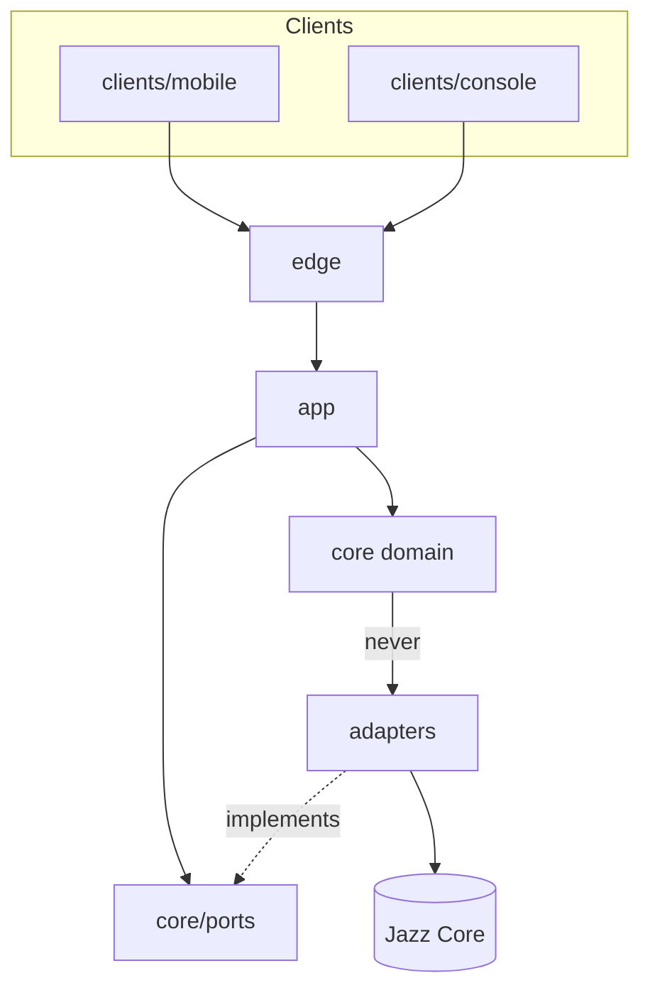
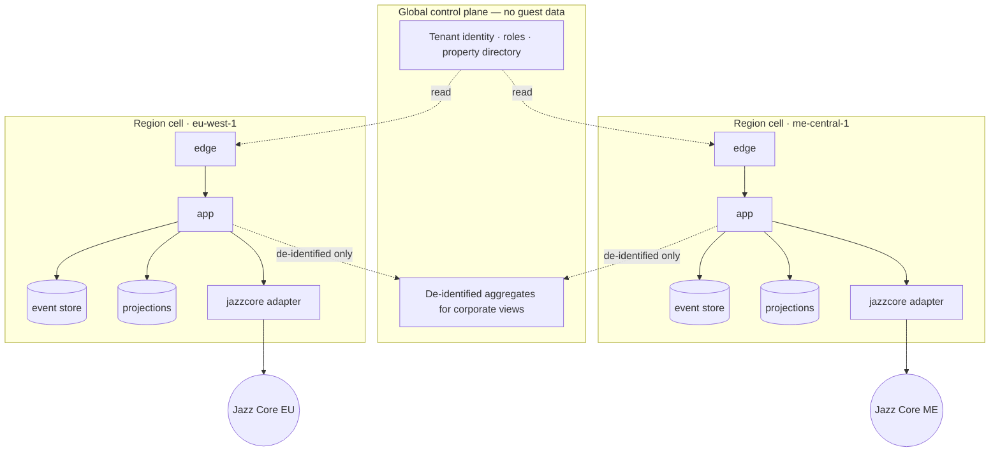
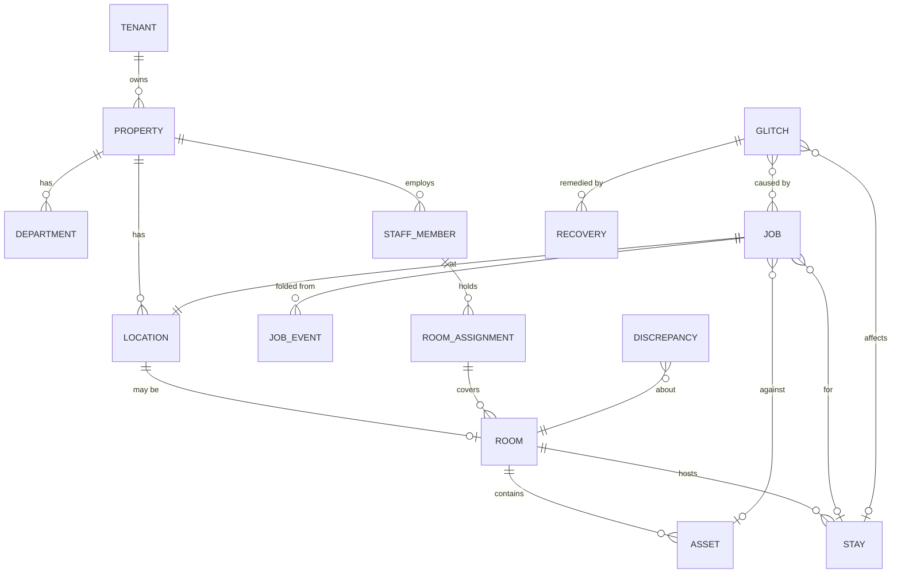

# Architecture Spine — JazzTicketing

## Design Paradigm

**Hexagonal (ports and adapters) around an event-sourced Job core, deployed as independent regional cells.**

The paradigm is chosen for one reason above all: every hard requirement in this product is a *time* requirement. An SLA clock that pauses, escalates, survives reassignment, and must be recomputable from an action taken offline forty minutes ago is not a status column — it is a fold over an ordered event log. Making that the core, and pushing every external system to an adapter, buys the rest of the architecture for free.

| Layer | Namespace | Holds |
| --- | --- | --- |
| Domain | `core/` | Job, Room, Stay projection, Assignment, Glitch, Asset. Pure; no I/O, no framework, no clock of its own. |
| Ports | `core/ports/` | Interfaces the domain needs: `JazzCorePort`, `NotificationPort`, `ClockPort`, `EventStore`, `ReadModel`. |
| Adapters | `adapters/` | One per external reality: `jazzcore/`, `push/`, `email/`, `sms/`, `identity/`, `storage/`. |
| Application | `app/` | Command handlers, projections, sagas (escalation timers, PM generation, retention sweeps). |
| Edge | `edge/` | HTTP/API, sync endpoint, auth, tenancy resolution, rate limiting. |
| Clients | `clients/mobile/`, `clients/console/` | The two surfaces. No domain logic; they hold intent and presentation only. |

## Invariants & Rules



Dependencies point inward only. The domain knows ports, never adapters; adapters know ports and the outside world, never each other. A client never reaches an adapter or the datastore directly.

### AD-1 — The Job core is event-sourced; SLA is derived, never stored as a countdown

- **Binds:** all Job, Request, Work Order, Assignment and SLA behaviour (FR-7..FR-18, FR-30..FR-39, FR-58, FR-59, NFR-9)
- **Prevents:** two units computing elapsed time differently; a stored countdown that cannot absorb a late-arriving offline action; an audit trail reconstructed after the fact.
- **Rule:** every state change to a Job is an immutable event carrying `occurred_at` (when the actor acted), `recorded_at` (when the server accepted it), actor, and tenant/property. SLA state, elapsed time, paused duration and breach are **computed by folding events**, never written as mutable columns. Read models are projections and are always rebuildable from the log. Nothing outside `app/` writes to a projection.

### AD-2 — `occurred_at` is the domain clock; `recorded_at` is the system clock

- **Binds:** all clients, sync, SLA computation, audit, reporting (FR-58, FR-12, NFR-9)
- **Prevents:** an action queued offline at 09:31 being treated as having happened at 11:04, which silently rewrites SLA history and staff attribution.
- **Rule:** clients stamp `occurred_at` from the device and the server records `recorded_at` itself. SLA and history use `occurred_at`; ordering, idempotency and replication use `recorded_at`. A device clock more than a configured skew from server time is corrected on the server, the correction is recorded as an event, and the original client value is retained. All timestamps are UTC; Property-local time is a presentation concern only.

### AD-3 — Every row and every event carries `tenant_id` and `property_id`; isolation lives at one boundary [ADOPTED]

- **Binds:** all persistence, all queries, all exports and APIs (FR-1, FR-2, FR-83, DG-1)
- **Prevents:** a cross-tenant leak through a query someone forgot to scope — the single worst failure this product can have.
- **Rule:** tenant and property scope is resolved once, at the edge, into an immutable request context. **No repository method accepts an unscoped query**; the data-access layer refuses one at compile time or startup, not at review time. Row-level security is enabled in the datastore as the second line, not the first. A test suite that attempts cross-tenant reads through every public interface — search, list, export, report, API — is a release gate, and a failure blocks release.

### AD-4 — Regional cells; a Property never leaves its region; the control plane holds no guest data

- **Binds:** deployment, tenancy, residency, corporate reporting (DG-2, DG-3, DG-4, FR-76, FR-83)
- **Prevents:** guest-identifying data crossing a residency boundary to satisfy a cross-property view.
- **Rule:** each region runs a complete, independent cell (edge, app, event store, projections, adapters). A Property is pinned to one cell permanently. A **global control plane** holds only tenant identity, role definitions, property directory and pre-aggregated, de-identified metrics; it holds **no guest-identifying data and no Job content**. Cross-property corporate views (FR-76) are served from those aggregates, never by querying cells in another region. A cell can serve its properties with the control plane unavailable.

### AD-5 — Jazz Core is reached through one port with one owner

- **Binds:** every Jazz Core interaction (FR-49..FR-57, FR-77, FR-78)
- **Prevents:** three modules each learning their own dialect of the upstream, and an outage that takes down features it should not.
- **Rule:** all Jazz Core traffic passes through `adapters/jazzcore` behind `JazzCorePort`. No other module imports a Jazz Core type or DTO; the adapter translates to domain types at the boundary. The port is versioned and capability-negotiated per Property (FR-78): an absent capability disables the dependent feature with a stated reason, and the domain must handle every capability as optional. Unknown event types and unknown fields are ignored, never fatal. Every call is timeout-bounded with a retry budget; no user-facing operation blocks indefinitely on it.

### AD-6 — Cleanliness is ours; occupancy is Jazz Core's; conflicts resolve by a declared authority and are never silently discarded

- **Binds:** Room Status, discrepancies, sync (FR-19, FR-50, FR-51, FR-79)
- **Prevents:** the PMS and the floor drifting apart, and a staff member's recorded observation vanishing in a merge.
- **Rule:** field-level authority is declared per field, not per record: occupancy is Jazz Core-authoritative, cleanliness is JazzTicketing-authoritative, per-Property configurable. A losing write is **preserved as a recorded event with its resolution**, never dropped. A mismatch a human observed becomes a Discrepancy (FR-79) and never mutates occupancy.

### AD-7 — Offline is a first-class write path; the client owns a durable queue and idempotency is server-enforced

- **Binds:** mobile client, sync endpoint, all mutations (FR-58, FR-59, FR-62, NFR-2)
- **Prevents:** duplicate jobs from a retried sync; a completion lost to an app kill; a conflict resolved by whichever packet arrived second.
- **Rule:** every client mutation carries a client-generated idempotency key and survives process death in a durable local store — on the handset, the intent and its idempotency key are written to SQLite in the *same* transaction as the optimistic local state change, so there is no window in which the user sees a completion the queue does not hold. The server is idempotent on the tuple `(tenant_id, property_id, staff_member_id, client_key)` and retains it for 30 days — the key is scoped to the person, not the device, because handsets are shared and a device-scoped key would collide across shifts. Sync is a **batch of intents, not a state diff** — the client sends what the user did, never what it thinks the world should look like. Conflict resolution is a documented per-intent rule (a supervisor reassignment beats a queued start; a completion is never lost and lands on the reassigned Job), and every resolution is visible to both parties. Photos upload separately from the action; a failed photo never rolls back a completion.

### AD-8 — Notification delivery is an adapter concern with a suppression contract in the domain

- **Binds:** dispatch, escalation, quiet hours, notification volume (FR-60, FR-65..FR-68, SM-C3)
- **Prevents:** every module growing its own send-a-push call, and an escalation storm that trains staff to ignore the app.
- **Rule:** the domain emits *intents to notify* with a reason and an audience; `adapters/push|email|sms` decide delivery. Suppression, coalescing and quiet hours are evaluated in the domain, not in the channel, so behaviour is identical across channels and testable without one. Breach notifications to management roles are never suppressed. Delivery outcomes return as events so FR-60's "every push has an Inbox counterpart" is a projection, not a client-side guess.

### AD-9 — Configuration is versioned and effective-dated; a running clock is never rewritten

- **Binds:** catalog, SLA, escalation, credits, checklists, thresholds (FR-5, FR-12, FR-66, FR-81, FR-83)
- **Prevents:** a target change retroactively breaching two hundred open jobs, and a tenant default silently re-applying to a property that overrode it.
- **Rule:** every configuration value is immutable and versioned; a Job binds the configuration version in force at its creation and keeps it for life — **and every later evaluation reads the Job's bound version, not the current one.** That includes escalation chains fired hours afterwards, pause ceilings, and the fields required to close. A saga that reads current configuration is a defect. Property values override tenant defaults, and an override is a **permanent decoupling** — a later tenant change does not re-apply. Every change is attributed and retained (FR-6).

### AD-10 — Guest data is minimised at ingestion and erasable by construction

- **Binds:** Jazz Core adapter, Stay projection, retention, erasure (DG-1, DG-2, DG-3, FR-45, FR-53)
- **Prevents:** an erasure request becoming a search-and-destroy across projections, logs and exports.
- **Rule:** the permitted guest field set is enforced **at ingestion in the adapter** — an excluded field never enters the system, so it cannot leak into a log or a projection. All guest-identifying data hangs off the Stay projection and nowhere else; domain events reference a Stay, never copy guest fields into themselves. Erasure de-identifies the Stay and rewrites nothing else. Guest identity never appears in the control plane (AD-4) or in any list surface for a line-staff role.

### AD-11 — Permission is a server decision; the interface only hides what the server would refuse

- **Binds:** roles, access, custom roles, admin surfaces (FR-2, FR-81, FR-83)
- **Prevents:** a hidden button treated as a security boundary, and a tenant admin minting a superuser.
- **Rule:** every command authorises against the request context server-side. Permission dependencies and the privilege-escalation guard (an actor cannot grant a permission they do not hold) are enforced in the domain, not the client. Tenant creation is **not a permission any hotel-side role can hold** — it lives outside this system's authorisation model entirely (FR-1).

### AD-12 — One localisation and direction contract, honoured by both clients

- **Binds:** both clients, all content, all exports (FR-61, NFR-10)
- **Prevents:** a second layout for RTL, and numerals that reverse in a room number.
- **Rule:** clients are authored in logical direction (start/end) with no left/right in layout — in Flutter that means `EdgeInsetsDirectional`, `AlignmentDirectional` and a `Directionality` ancestor, never `EdgeInsets.only(left:)`; in the console it means CSS logical properties. Bidi isolation is explicit `FSI`/`PDI` wrapping around identifiers on both clients, not a per-widget workaround. Job identifiers, Room numbers and clock times render in Western digits in every locale and are bidi-isolated, with any adjacent separator inside the isolate. Free text is stored with its language tag and shown as entered — never machine-translated. Server-generated user-facing strings are localised server-side against the recipient's Staff Member language.

### AD-13 — One writing owner per aggregate; everyone else asks

- **Binds:** every module that changes shared state (all of `core/`, `app/`)
- **Prevents:** two modules emitting events for the same entity with different semantics — the concrete case: `core/housekeeping` flipping a Room to clean on assignment completion while `core/room` also owns Room status, producing two event shapes for one fact and a projection that double-counts.
- **Rule:** each aggregate has exactly one owning module that may emit its events: Job → `core/job`; Room status and Discrepancy → `core/room`; RoomAssignment, Credits and Inspection → `core/housekeeping`; Glitch and Recovery → `core/incident`; notification dispatch → `app/notification`. Any other module needing a change **issues a command to the owner** and reacts to the resulting event. No module emits another's events, and no two modules subscribe to the same event to write the same projection.

### AD-14 — One SLA fold, called everywhere; never reimplemented

- **Binds:** every surface, projection, report and export that shows an SLA figure (FR-12, FR-13, FR-69, FR-71, FR-73, SM-2)
- **Prevents:** the dashboard reporting 94% compliance while the month-end report says 91% because two projections each decided independently how to treat paused time, reassignment, or a job that breached while offline. Two units can obey every other AD here and still produce different numbers for the same question.
- **Rule:** the SLA fold — elapsed, paused, remaining, breached — exists **once**, in `core/job`, as a pure function over an event sequence. Every projection, report, export and console display calls it; none reimplements it, and no SQL computes elapsed time.

**Amended for a Dart handset.** The handset shows a live countdown while offline, so it cannot call the server's fold and cannot import it either — Dart and TypeScript do not share code. There is therefore **exactly one** permitted second implementation in the whole system: a Dart port of the fold in `clients/mobile`, and no other Dart copy anywhere. Its equivalence is not a matter of care: the fixture suite in `contracts/` — the same vectors, covering paused time, reassignment, and a breach that happened while the device was offline — is executed by both the TypeScript and the Dart implementations, and both runs are a **release gate**. A fixture added on the server side that the Dart port has not been updated for fails the build. This is the single largest cost of the Flutter decision, and it is deliberately fenced to one function with a mechanical check rather than left to review.

## Consistency Conventions

| Concern | Convention |
| --- | --- |
| Entity naming | The PRD Glossary is binding and verbatim in code: `Job`, `Request`, `WorkOrder`, `RoomAssignment`, `Stay`, `Glitch`, `Recovery`, `Asset`, `Discrepancy`. Never `ticket` or `task` in any identifier. |
| Events | Past tense, domain-first: `JobDispatched`, `RoomStatusChanged`, `SlaClockPaused`, `DiscrepancyFiled`. One event per real-world fact, never one per table write. |
| Ids | ULID for everything the system creates (sortable by creation, safe in URLs). Room numbers and Jazz Core identifiers are external strings and never re-keyed. |
| Dates & times | UTC, RFC 3339, `occurred_at` / `recorded_at` per AD-2. Property timezone is presentation only. |
| Money | Minor units as integers plus an ISO-4217 code. No conversion anywhere in v1 (FR-42, FR-73). |
| Client contracts | No wire type is hand-written on either side. `contracts/` is the source; TypeScript and Dart bindings are generated, and a drift check is part of CI. A contract change is one edit in one place plus a regenerate. |
| Cross-language parity | The SLA fold is the only function implemented twice (TS server, Dart handset — AD-14). Its shared fixture vectors run in both languages as a release gate. Nothing else may be ported by hand. |
| Errors | One envelope: stable machine `code`, a localisable `message` key, and a `retryable` flag. No stringly-typed errors across a boundary. |
| API shape | Commands are POSTs returning the accepted event; reads are projections. Sync is one endpoint taking a batch of intents (AD-7). |
| Config | Versioned records, never environment-variable feature behaviour. Secrets from the platform secret store; never on a device. |
| Logging | Structured, with tenant, property, actor, correlation id, and the Jazz Core exchange id where relevant. Guest identifiers are never logged (AD-10). |
| Tests | Domain is unit-tested with a fake clock and fake ports. Cross-tenant isolation (AD-3), offline conflict rules (AD-7) and Jazz Core contract tolerance (AD-5) are each a release gate, not a suite someone can skip. |

## Stack

`[ASSUMPTION]` **Every version here is unverified.** Web access is blocked in this session, so these come from training knowledge rather than a current check — which is a gap in the process, not a judgement I am confident in. The architecture workflow requires each named technology to be web-confirmed before binding; **treat this table as a proposal and verify every row before anyone commits.** The paradigm and the ADs above do not depend on these choices.

| Name | Version |
| --- | --- |
| TypeScript (server and console client) | 5.x |
| Dart (mobile client) | 3.x |
| Node.js runtime | 22 LTS |
| API framework | NestJS 10.x |
| PostgreSQL (event store + projections) | 16.x |
| Event store | Postgres tables, not a dedicated engine — see Deferred |
| Cache / ephemeral state | Redis 7.x |
| Realtime to console | WebSocket over the edge; server-sent events as fallback |
| Mobile client | Flutter 3.2x (stable channel) + Dart 3.x; domain types **generated** from `contracts/`, never hand-written |
| Mobile local store | SQLite via Drift — durable queue written in the same transaction as the local write (AD-7) |
| Mobile background sync | Platform-scheduled background work (`workmanager` over WorkManager / BGTaskScheduler); the queue drains without the app in the foreground |
| Console client | React 18 + Vite, TanStack Query, no CSS framework — tokens from `DESIGN.md` |
| Push | FCM (Android) + APNs (iOS) behind one server adapter; the client registers through `firebase_messaging` |
| Contract codegen | OpenAPI 3.1 + event schemas in `contracts/` as the single source; TypeScript types for server and console, Dart models for the handset, locale keys to ARB. CI fails on drift. |
| Container platform | Managed Kubernetes or equivalent per region — see Deferred |

**Why Flutter for the handset, and what it costs.** The mobile client is a shared handset used all shift on cheap Android hardware in corridors and stairwells: one rendered UI on both platforms, a predictable frame budget that does not depend on a JS bridge, first-class logical-direction layout for Arabic (AD-12), and a single build for the two OS families the properties actually carry. The cost is explicit and paid in one place — **server and handset no longer share types by construction.** TypeScript on both sides would have made a contract change a compiler error; with Dart it becomes a codegen step and a CI drift check. So `contracts/` stops being a convenience and becomes load-bearing: it is the schema of record, both language bindings are generated from it, and nothing hand-writes a wire type on either side. The console stays TypeScript/React — it shares the server's types directly and has no reason to move.

**Why Postgres as the event store:** the event volume here (NFR-4: ~4,000 jobs per property per day) is nowhere near needing a dedicated event engine, and one datastore per cell is a smaller operational surface for an existing team.

## Structural Seed





`Job` is the supertype of Request and Work Order. `RoomAssignment` is deliberately **not** a Job — it is workload allocation, and collapsing the two is the modelling error this ERD exists to prevent.

```text
jazzticketing/
  core/            # domain — pure, no I/O, no framework
    job/           # Job aggregate, SLA fold, lifecycle
    room/          # Room status, authority rules, discrepancy
    housekeeping/  # RoomAssignment, credits, inspection
    incident/      # Glitch, Recovery, approval thresholds
    ports/         # JazzCorePort, NotificationPort, ClockPort, EventStore, ReadModel
  app/             # command handlers, projections, sagas (escalation, PM, retention)
  adapters/
    jazzcore/      # the only place a Jazz Core type exists
    push/ email/ sms/ identity/ storage/
  edge/            # HTTP, sync endpoint, auth, tenancy resolution
  clients/
    mobile/        # Flutter (Dart) — durable queue, offline intents, the one Dart SLA fold
    console/       # React — dense, keyboard-first
  contracts/       # SCHEMA OF RECORD: OpenAPI, event schemas, error codes, locale keys,
                   # SLA fixture vectors. TS and Dart bindings are GENERATED from here.
  ops/             # per-region deployment, migrations, isolation test gate
```

## Capability → Architecture Map

| Area | Lives in | Governed by |
| --- | --- | --- |
| Job lifecycle, SLA, escalation (FR-7..FR-18) | `core/job`, `app/sagas` | AD-1, AD-2, AD-8, AD-9 |
| Housekeeping, boards, inspection (FR-19..FR-29) | `core/housekeeping`, `core/room` | AD-1, AD-6, AD-9 |
| Engineering, assets, PM (FR-30..FR-39) | `core/job`, `app/sagas` | AD-1, AD-9 |
| Incidents, recovery, approvals (FR-40..FR-48) | `core/incident` | AD-1, AD-10, AD-11 |
| Jazz Core integration (FR-49..FR-57, FR-77, FR-78) | `adapters/jazzcore` | AD-5, AD-6, AD-10 |
| Mobile foundation, offline, sync (FR-58..FR-64) | `clients/mobile`, `edge/sync` | AD-2, AD-7, AD-12 |
| Notifications (FR-65..FR-68) | `core/*` intents, `adapters/push` | AD-8 |
| Reporting, dashboards, exports (FR-69..FR-76) | `app/projections`, control plane aggregates | AD-1, AD-3, AD-4, AD-10 |
| Tenancy, roles, admin (FR-1..FR-6, FR-81, FR-83) | `edge/auth`, control plane | AD-3, AD-4, AD-11 |
| Room status authority, discrepancy (FR-19, FR-51, FR-79) | `core/room` | AD-6 |
| Floor layouts (FR-80) | `core/room` seed data | AD-9 |

## Deferred

- **Dedicated event-store engine.** Postgres carries R1's volume comfortably. Revisit only if projection rebuild time or write contention becomes measurable — not on principle.
- **Cloud provider, Kubernetes flavour, IaC tooling.** A cell is provider-shaped, not provider-specific. Decide with the same team that operates Jazz Core, so the two are operable by one on-call rota (OR-4).
- **CQRS read-store split.** Projections start in the same Postgres instance. Split when a reporting query measurably hurts operational latency.
- **Search.** Postgres full-text serves R1's catalog and register searches. A search engine is a later, evidence-driven addition.
- **Floor layout editor (FR-80).** R2 at the earliest; the data shape is fixed here, the authoring surface is not designed.
- **Lost & Found (FR-46..FR-48).** R4. The Job core already carries what it needs.
- **AI triage and prediction.** Explicitly out of v1 (PRD §5). AD-1 is what makes it possible later: the event log is the training data, captured from day one without any AI in the build.
- **Dart on the server.** Not considered for v1. The server, console and existing Jazzware skills are TypeScript; moving the server to Dart to recover type sharing would trade a generated contract for a rewrite. Revisit only if the handset team and the server team turn out to be the same two people and the codegen step is measurably slowing them down.
- **Every version in the Stack table.** Unverified — see the note above. This is the one deferred item that is a process gap rather than a deliberate choice.

## Revision log

**2026-09-02 (b) — mobile client changed from React Native to Flutter.** Tanim's call. The paradigm, all 14 ADs and the regional-cell topology are unchanged; the decision touches the client edge of the system only. What moved:

- Stack: Flutter 3.2x + Dart 3.x, Drift-backed SQLite for the durable queue, platform background scheduling, `firebase_messaging` on the client with the server push adapter untouched.
- The "TypeScript both sides" rationale is withdrawn — it was the argument for React Native and does not survive the change. `contracts/` is promoted from a convenience to the schema of record with generated TS and Dart bindings and a CI drift check.
- **AD-14 is amended, not weakened.** An offline countdown in Dart cannot call or import the TypeScript fold, so the spine now permits exactly one second implementation — the Dart port — fenced by a shared fixture suite that both languages execute as a release gate. This was the one place the decision could have quietly broken SM-2, and it is closed explicitly.
- AD-7 and AD-12 gained concrete Flutter mechanisms; their rules are unchanged.

Downstream effect: `epics.md` release gates and E4 updated. No FR, NFR or screen changes.

