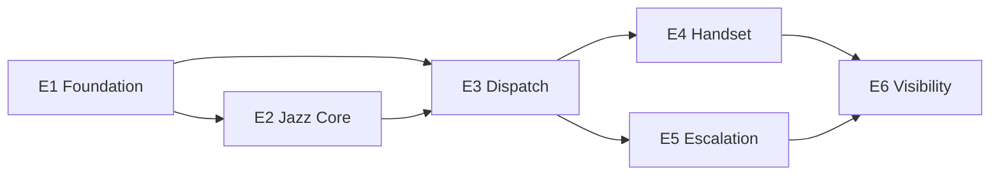

# JazzTicketing — Epic Breakdown

## Overview

The complete epic and story breakdown for **JazzTicketing**, decomposing the PRD, the two UX spines and the architecture spine into implementable stories. Ten epics, 87 stories, 83 functional requirements.

All source documents are `status: final`. Nothing upstream is re-decided here; a story that needs an upstream change is a conflict to surface, not a local override.

**Upstream revision absorbed:** the mobile client is **Flutter + Dart**, not React Native (spine revision 2026-09-02b). No FR, NFR or screen changed. Two things land in this document: the amended AD-14 row below, and a contract-drift release gate.

## Requirements Inventory

### Functional Requirements

83 FRs across nine feature groups, carried by their original PRD ids. FR-77 to FR-83 were added late (Jazz Core contract tolerance, capability negotiation, discrepancy reporting, floor layout, custom roles, roster import, tenant settings) and FR-1 was amended to split the Jazzware operator from the tenant administrator. Full text is in the PRD §4; each story below cites the FR it satisfies rather than restating it.

Group ownership: §4.1 Tenancy and configuration (FR-1..FR-6, FR-81..FR-83) · §4.2 Guest request dispatch (FR-7..FR-18) · §4.3 Housekeeping (FR-19..FR-29, FR-79, FR-80) · §4.4 Engineering (FR-30..FR-39) · §4.5 Incidents and Lost & Found (FR-40..FR-48) · §4.6 Jazz Core integration (FR-49..FR-57, FR-77, FR-78) · §4.7 Mobile foundation (FR-58..FR-64) · §4.8 Notifications (FR-65..FR-68) · §4.9 Reporting (FR-69..FR-76).

### NonFunctional Requirements

NFR-1 Availability · NFR-2 Survivability · NFR-3 Latency · NFR-4 Scale · NFR-5 Mobile device support · NFR-6 Accessibility · NFR-7 Security · NFR-8 Observability · NFR-9 Time correctness · NFR-10 Localization and bidirectionality · NFR-11 Jazz Core dependency posture.

These are not stories. NFR-6 and NFR-10 are acceptance criteria on **every** client story; NFR-9 is enforced by the single SLA fold; the rest are verified as gates (below).

### Additional Requirements

**Operational:** OR-1 Support model · OR-2 RTO/RPO · OR-3 Onboarding · OR-4 Jazz Core dependency operations · OR-5 Release cadence.

**Data governance:** DG-1 Guest data minimization · DG-2 Retention · DG-3 Right to erasure · DG-4 Residency · DG-5 Staff data · DG-6 Accessibility compliance · DG-7 Out of scope.

**Architecture invariants every story inherits (read-only, original ids):**

| AD | Binds every story to |
|---|---|
| AD-1 | The Job core is event-sourced; SLA is derived, never stored as a countdown |
| AD-2 | `occurred_at` is the domain clock; `recorded_at` is the system clock |
| AD-3 | Every row and every event carries `tenant_id` and `property_id`; isolation lives at one boundary [ADOPTED] |
| AD-4 | Regional cells; a Property never leaves its region; the control plane holds no guest data |
| AD-5 | Jazz Core is reached through one port with one owner |
| AD-6 | Cleanliness is ours; occupancy is Jazz Core's; conflicts resolve by a declared authority and are never silently discarded |
| AD-7 | Offline is a first-class write path; the client owns a durable queue and idempotency is server-enforced |
| AD-8 | Notification delivery is an adapter concern with a suppression contract in the domain |
| AD-9 | Configuration is versioned and effective-dated; a running clock is never rewritten |
| AD-10 | Guest data is minimised at ingestion and erasable by construction |
| AD-11 | Permission is a server decision; the interface only hides what the server would refuse |
| AD-12 | One localisation and direction contract, honoured by both clients |
| AD-13 | One writing owner per aggregate; everyone else asks |
| AD-14 | One SLA fold in TypeScript for server and console, plus **exactly one** Dart port for the offline handset; both run the same fixture vectors [AMENDED 2026-09-02b] |

### UX Design Requirements

The two UX spines are `status: final` and 63 surfaces are designed (24 mobile screens, 39 console surfaces), audited against the PRD in `screen-coverage.md`. Every story that touches an interface inherits, as acceptance criteria rather than as a separate epic:

- **UX-DR-1 State without colour.** Every state distinction survives greyscale and is legible at arm's length in low light (NFR-6, FR-63).
- **UX-DR-2 Logical direction only.** No left/right in layout; Arabic ships in R1; identifiers and clock times are Western digits inside bidi isolates with any adjacent separator inside the isolate (AD-12, FR-61).
- **UX-DR-3 One state vocabulary.** A tile, row or badge never means something different between two views — grid and plan, mobile and console (FR-80).
- **UX-DR-4 Thumb-zone reachability.** Accept, start and complete are reachable one-handed on the baseline device, gloved (NFR-5, FR-63).
- **UX-DR-5 Named freshness.** Any surface showing Jazz Core-sourced context names the time of the last successful exchange when that context is stale (FR-49, FR-57).
- **UX-DR-6 Design tokens are the source.** Colour, spacing and type come from `DESIGN.md`; the accent is petrol `#27565D` on white ink, cyan is a highlight and never a button ground.

### FR Coverage Map

Generated from the story bodies, not asserted: an FR appears here against the epic that owns it and every story in that epic whose acceptance criteria cite it. A citation of an FR by a story in a *different* epic is consumption, not ownership (see **Ownership and consumption** below), and is excluded. Story 1.0 is scaffolding and cites no FR, so it does not appear.

| FR | Epic | Story / stories |
|---|---|---|
| FR-1 | E1 | 1.1, 1.2, 1.3 |
| FR-2 | E1 | 1.3 |
| FR-3 | E1 | 1.5 |
| FR-4 | E4 | 4.1, 4.6, 4.7, 4.8 |
| FR-5 | E1 | 1.7, 1.8, 1.9 |
| FR-6 | E1 | 1.4, 1.7, 1.8, 1.9, 1.10, 1.11 |
| FR-7 | E3 | 3.1 |
| FR-8 | E3 | 3.3 |
| FR-9 | E3 | 3.4, 3.5 |
| FR-10 | E3 | 3.2 |
| FR-11 | E3 | 3.6 |
| FR-12 | E3 | 3.4 |
| FR-13 | E3 | 3.7 |
| FR-14 | E3 | 3.6, 3.8 |
| FR-15 | E6 | 6.4 |
| FR-16 | E6 | 6.5 |
| FR-17 | E3 | 3.9 |
| FR-18 | E3 | 3.10 |
| FR-19 | E2 | 2.1 |
| FR-20 | E7 | 7.1 |
| FR-21 | E7 | 7.3 |
| FR-22 | E7 | 7.4 |
| FR-23 | E7 | 7.5 |
| FR-24 | E7 | 7.6 |
| FR-25 | E7 | 7.7 |
| FR-26 | E7 | 7.8 |
| FR-27 | E7 | 7.9 |
| FR-28 | E7 | 7.2 |
| FR-29 | E7 | 7.10 |
| FR-30 | E8 | 8.1, 8.9 |
| FR-31 | E8 | 8.2 |
| FR-32 | E8 | 8.6 |
| FR-33 | E8 | 8.7, 8.10 |
| FR-34 | E8 | 8.5 |
| FR-35 | E8 | 8.4 |
| FR-36 | E3 | 3.11 |
| FR-37 | E8 | 8.3 |
| FR-38 | E8 | 8.6, 8.8 |
| FR-39 | E8 | 8.9 |
| FR-40 | E9 | 9.1 |
| FR-41 | E9 | 9.2 |
| FR-42 | E9 | 9.3 |
| FR-43 | E9 | 9.4 |
| FR-44 | E9 | 9.5 |
| FR-45 | E9 | 9.6 |
| FR-46 | E9 | 9.7 |
| FR-47 | E9 | 9.8, 9.9 |
| FR-48 | E9 | 9.8, 9.9 |
| FR-49 | E2 | 2.2, 2.3, 2.6 |
| FR-50 | E2 | 2.6, 2.9 |
| FR-51 | E2 | 2.7, 2.9, 2.10, 2.13 |
| FR-52 | E2 | 2.8 |
| FR-53 | E2 | 2.5 |
| FR-54 | E2 | 2.11 |
| FR-55 | E2 | 2.12 |
| FR-56 | E2 | 2.9 |
| FR-57 | E2 | 2.13 |
| FR-58 | E4 | 4.3 |
| FR-59 | E4 | 4.4 |
| FR-60 | E4 | 4.7 |
| FR-61 | E4 | 4.1, 4.6 |
| FR-62 | E4 | 4.5 |
| FR-63 | E4 | 4.2 |
| FR-64 | E4 | 4.8 |
| FR-65 | E5 | 5.1 |
| FR-66 | E5 | 5.2 |
| FR-67 | E5 | 5.3 |
| FR-68 | E5 | 5.1, 5.4 |
| FR-69 | E6 | 6.1 |
| FR-70 | E10 | 10.1 |
| FR-71 | E6 | 6.2 |
| FR-72 | E8 | 8.4, 8.10 |
| FR-73 | E10 | 10.2 |
| FR-74 | E6 | 6.3 |
| FR-75 | E10 | 10.3 |
| FR-76 | E10 | 10.4 |
| FR-77 | E2 | 2.3, 2.4 |
| FR-78 | E2 | 2.3, 2.4 |
| FR-79 | E2 | 2.10 |
| FR-80 | E7 | 7.11 |
| FR-81 | E1 | 1.4 |
| FR-82 | E1 | 1.10 |
| FR-83 | E1 | 1.5, 1.6 |

**83 of 83** functional requirements map to at least one story; **87 stories** total, of which one (1.0) is scaffolding.
### Cross-cutting requirements that are release gates, not stories

- **AD-3 / DG-1** — a cross-tenant read attempted through every public interface must fail. Its test suite gates every release, so it is not one story's acceptance criterion.
- **AD-14 / NFR-9** — the SLA fold has one TypeScript implementation and one Dart port for the handset (the client is Flutter, and an offline countdown can neither call nor import the server's fold). The fixture vectors in `contracts/` run in **both** languages and both runs gate the release. Any story showing an SLA figure consumes one of those two; no story adds a third.
- **Contract drift** — `contracts/` is the schema of record and the TypeScript and Dart bindings are generated from it. The codegen-drift check gates every release, so no story owns "keep the client types in sync"; a hand-written wire type on either side is a build failure, not a review comment.
- **AD-7** — offline conflict rules are fixed per intent and verified as a suite.
- **NFR-6 / FR-61** — greyscale legibility and bidirectional layout are acceptance criteria on every client story, not an epic of their own.

## Epic List

Ten epics. Six deliver R1; four carry R2–R4. Each is standalone: it delivers user value on its own and enables later epics without depending on them.

| Epic | Release | Delivers | FRs |
|---|---|---|---|
| **E1 — Property go-live foundation** | R1 | A property administrator can stand a property up, put the right people in it with the right access, tune it to how the hotel works, and see every change that was made. | 8: FR-1, FR-2, FR-3, FR-5, FR-6, FR-81, FR-82, FR-83 |
| **E2 — Jazz Core connection and room truth** | R1 | The property's operational reality — rooms, stays, calls — is in the system without anyone typing it, and when the upstream degrades the product says so instead of lying. | 13: FR-19, FR-49, FR-50, FR-51, FR-52, FR-53, FR-54, FR-55, FR-56, FR-57, FR-77, FR-78, FR-79 |
| **E3 — Guest request dispatch with a live clock** | R1 | A guest request gets an owner and a deadline in seconds, moves through a lifecycle anyone can audit, and cannot quietly go nowhere. | 11: FR-7, FR-8, FR-9, FR-10, FR-11, FR-12, FR-13, FR-14, FR-17, FR-18, FR-36 |
| **E4 — The handset — line staff work the floor** | R1 | A room attendant or engineer signs in on a shared handset in their own language, sees what to do next, and keeps working when the signal dies. Flutter client: it carries the durable offline queue and the one Dart SLA fold. | 8: FR-4, FR-58, FR-59, FR-60, FR-61, FR-62, FR-63, FR-64 |
| **E5 — Escalation and notification routing** | R1 | Nobody has to watch a screen for work to arrive, and a job that breaches finds a human instead of sitting still. | 4: FR-65, FR-66, FR-67, FR-68 |
| **E6 — Manager visibility and guest follow-up** | R1 | A manager can see load and breaches while the shift is still recoverable, prove SLA against the property's own baseline, and close the loop with the guest. | 5: FR-15, FR-16, FR-69, FR-71, FR-74 |
| **E7 — Housekeeping operations** | R2 | Boards, room flow, inspections and turndown — the highest-volume surface in the product and the strongest proof of two-way room status. | 11: FR-20, FR-21, FR-22, FR-23, FR-24, FR-25, FR-26, FR-27, FR-28, FR-29, FR-80 |
| **E8 — Engineering, assets and preventive maintenance** | R3 | Reactive work orders against an asset registry that accumulates history, plus the preventive schedule a busy day would otherwise bury. | 10: FR-30, FR-31, FR-32, FR-33, FR-34, FR-35, FR-37, FR-38, FR-39, FR-72 |
| **E9 — Incidents, recovery and Lost & Found** | R4 | Service failure gets recorded with a cause and a cost, recovery is approved rather than improvised, and found property has a chain of custody. | 9: FR-40, FR-41, FR-42, FR-43, FR-44, FR-45, FR-46, FR-47, FR-48 |
| **E10 — Full reporting and evidence** | R4 | The GM dashboard, glitch and recovery reporting, the brand evidence pack, and the corporate cross-property view. | 4: FR-70, FR-73, FR-75, FR-76 |

### Ownership and consumption

All 83 functional requirements are owned by **exactly one** epic — no gaps, no requirement owned twice. Verified programmatically rather than by reading.

Five requirements are *used* by an epic that does not own them. Ownership means the acceptance criteria live there and that epic is done when they pass; a consuming epic depends on the behaviour but adds no criteria of its own for it.

| FR | Owner | Also consumed by | Why the split falls here |
|---|---|---|---|
| FR-4 Shared Device sign-in | E4 | E1 | The sign-in and hand-off behaviour is a handset concern. E1 only provisions the PIN credential, as part of FR-3 and FR-82. |
| FR-11 Acceptance window | E3 | E5 | The window is a derivation of the SLA fold (AD-14), so it belongs with the clock. E5 consumes its expiry as a chain trigger. |
| FR-14 Breach and Escalation | E3 | E5 | Same reason: breach is derived, never stored. E3 decides *that* a job breached; E5 decides *who hears about it*. |
| FR-18 Open Request views | E3 | E6 | The open and unassigned queues are the dispatch surface a supervisor works from. E6's dashboards read the same data but are specified under FR-69. |
| FR-60 Push notification | E4 | E5 | The PRD groups push inside the mobile foundation (FR-58–FR-64), and device registration and receipt are client work. E5 owns the routing that decides what gets sent (AD-8). |

### Dependency order within R1

E1 and E2 can run in parallel from week one. E2 is sequenced early despite being the least visible, because it carries the plan's only external dependency and the R1 demo has no spine without it.

### Backlog order vs epic number

Within an epic, no story depends on a later story in the same epic. Three stories are exceptions to *epic* order and are called out on the story itself, because their prerequisite lives in a later-numbered epic — for these the backlog position, not the epic number, governs:

| Story | Waits for | Why |
|---|---|---|
| 2.11 Guest call becomes a Request draft | 3.1 | A draft Request cannot exist before Requests do. |
| 2.12 Undelivered wake-up call raises a Job | 3.1, 3.2 | Same reason. |
| 3.9 Staff-raised Request from the handset | 4.1, 4.2 | The FR specifies the mobile surface, which E4 delivers. |
| 1.7 Configure Departments, Locations and Rooms | 2.5 *(one criterion only)* | Its master-data reconciliation criterion applies only once a Jazz Core connection exists. The story is complete and testable without it; that criterion is verified when 2.5 lands. |

Nothing else crosses. Every other story's prerequisites sit earlier in its own epic or in an epic the graph above already places before it. Verified programmatically: every inter-story reference in every acceptance criterion was extracted and checked, and the four rows above are the complete set of exceptions.

---

## Epic 1: Property go-live foundation

**Goal:** A property administrator can stand a property up, put the right people in it with the right access, tune it to how the hotel works, and see every change that was made — without engineering involvement. This epic is the boundary the whole product stands on: every record in every later epic resolves to exactly one Property, and every permission decision later assumed to exist is decided here. **Release R1.** FRs: FR-1, FR-2, FR-3, FR-5, FR-6, FR-81, FR-82, FR-83. Twelve stories: 1.0 is scaffolding and carries no FR; 1.1 through 1.11 carry the requirements.

### Story 1.0: Stand up the repository, the first cell, and the three gates

As a **JazzTicketing engineer**,
I want the source tree, one running region cell and the three release gates in place and green,
So that every story after this one is verified by the checks the architecture depends on rather than assuming they exist.

*Plumbing, not user value — added deliberately at Tanim's decision on 2026-09-02. The spine names no starter template, and the three CI gates below cannot pass on any story until the pipeline that runs them exists. Without this story every later story inherits an unstated prerequisite.*

**Acceptance Criteria:**

**Given** the source tree defined in the architecture spine
**When** the repository is initialised
**Then** it contains `core/`, `core/ports/`, `adapters/`, `app/`, `edge/`, `clients/mobile`, `clients/console`, `contracts/` and `ops/`, with dependencies pointing inward only
**And** a lint rule fails the build if `core/` imports from `adapters/`, `edge/` or `app/`.

**Given** `contracts/` as the schema of record
**When** CI runs
**Then** the TypeScript and Dart bindings are generated from it and the **codegen-drift gate** fails the build if a generated file differs from a committed one, or if a wire type is hand-written on either side.

**Given** a trivial SLA fixture in `contracts/`
**When** CI runs
**Then** the **two-language fixture gate** executes it against both the TypeScript fold and the Dart port, and the build fails if either is absent or disagrees (AD-14).

**Given** two seeded tenants in one cell
**When** the **cross-tenant isolation suite** runs against every public interface — reads, search, exports and direct API calls
**Then** every cross-tenant access attempt fails, and the build fails if any succeeds (AD-3, DG-1).

**Given** one region cell
**When** it is deployed from `ops/`
**Then** it runs the API, the Postgres event store and projections, and Redis, with migrations applied from source and no guest data in the control plane (AD-4)
**And** the cell is reproducible from the repository alone, with no hand configuration step that is not committed.

**Given** all three gates
**When** they first run
**Then** each is green over trivial fixtures, so that a later failure means a real regression rather than an unfinished gate.

**Given** this story
**When** it is estimated
**Then** the stack versions it pins are treated as **unverified** — every version in the spine's Stack table came from training knowledge with web access blocked, and confirming them is part of this story's work, not an assumption inside it.

### Story 1.1: Provision a Tenant

As a **Jazzware operator**,
I want to create a Tenant and its first administrator on an internal surface,
So that a new customer can be onboarded without Jazzware holding standing access to their data.

**Acceptance Criteria:**

**Given** I am authenticated as a Jazzware operator on the internal provisioning surface
**When** I create a Tenant with a name and a first administrator email
**Then** the Tenant exists with the shipped role set and platform defaults seeded
**And** no Properties and no identity connection are created — those are the customer's to configure
**And** the first administrator receives an invitation that grants tenant-administrator scope only.

**Given** I am authenticated as any hotel-side role, including tenant administrator
**When** I attempt Tenant creation through any interface, including a direct API call
**Then** the attempt is refused server-side with a permission error (AD-11, FR-1)
**And** the product presents no link or affordance to the internal surface.

**Given** a provisioned Tenant
**When** a Jazzware support engineer needs access to its data
**Then** access must be separately requested and is time-boxed
**And** the grant, its scope and its expiry are recorded in that Tenant's own audit trail.

**Given** a Tenant with operational records
**When** an operator attempts to delete it
**Then** deletion is prevented and only deactivation is offered.

### Story 1.2: Create a Property under a Tenant

As a **tenant administrator**,
I want to create a Property and choose its region,
So that the hotel has a scope for its rooms, staff and configuration before anyone starts work in it.

**Acceptance Criteria:**

**Given** I am a tenant administrator
**When** I create a Property with a name, timezone, currency and region
**Then** the Property exists in the chosen region's cell, inherits the Tenant defaults, and is marked as setup-incomplete until its required configuration is present
**And** the region is displayed as immutable from this point forward (DG-4, AD-4).

**Given** an existing Property
**When** anyone attempts to change its region through any interface
**Then** the change is refused, with residency named as the reason.

**Given** a Property with operational records
**When** a tenant administrator attempts to delete it
**Then** deletion is prevented and only deactivation is offered (FR-1)
**And** a deactivated Property's records remain readable to authorised users and stop accepting new Jobs.

**Given** a Property that is setup-incomplete
**When** a tenant administrator opens it
**Then** the outstanding configuration steps are listed in the order they must be completed.

### Story 1.3: Invite a Staff Member and assign roles per Property

As a **property or tenant administrator**,
I want to invite a person and give them roles at one or more Properties,
So that what they can see and act on is decided before they ever sign in.

**Acceptance Criteria:**

**Given** I am an administrator with scope over a Property
**When** I invite a person with a name, a language, an optional email and one or more Property/role pairs
**Then** the Staff Member is created with exactly those roles at exactly those Properties
**And** an invitation with an email address issues a credential set-up link, while one without creates a PIN-only account usable on a Shared Device.

**Given** the shipped role set
**When** I open the role picker
**Then** it offers at minimum line staff, supervisor, department manager, front office, duty manager, property administrator and corporate viewer (FR-2).

**Given** a Staff Member holding roles at two Properties in the same Tenant
**When** they switch Property context in either client
**Then** the switch completes without signing out, and their permissions are re-resolved for the new Property.

**Given** a Staff Member whose role does not permit an action
**When** the action is attempted through any interface, including a direct API call with a crafted payload
**Then** it is refused server-side, not merely hidden in the interface (FR-2, AD-11).

**Given** a corporate-scoped Staff Member
**When** they read any list, search, report, export or API response
**Then** only records from Properties within their own Tenant are returned (FR-1).

### Story 1.4: Define and duplicate custom roles with guards

As a **tenant administrator**,
I want to duplicate a shipped role and edit the copy,
So that the hotel's own job titles map onto permissions without me being able to create an incoherent or escalated role.

**Acceptance Criteria:**

**Given** a shipped role
**When** I open it
**Then** it is duplicable but not editable, so the shipped baseline stays intact for support (FR-81)
**And** the interface states before the copy is made that the duplicate is independent at creation and will not inherit later changes to its source.

**Given** I am editing a custom role and a permission declares a dependency
**When** I enable that permission while its dependency is disabled
**Then** the enable is refused and the interface names the specific dependency that must be enabled first.

**Given** I hold a set of permissions
**When** I attempt to grant a role any permission I do not myself hold
**Then** the attempt is refused server-side, not only disabled in the interface (FR-81, AD-11).

**Given** any role creation, duplication or permission change
**When** it is saved
**Then** the audit trail records the actor, the timestamp and the previous value (FR-6)
**And** the per-role Recovery approval threshold is settable here for later use by FR-43.

### Story 1.5: Connect a Tenant identity provider

As a **tenant administrator**,
I want to connect our existing identity provider,
So that corporate and management users authenticate through it rather than holding another password.

**Acceptance Criteria:**

**Given** I am a tenant administrator
**When** I configure a SAML 2.0 or OIDC connection for my Tenant
**Then** the connection applies to that Tenant only, never globally (FR-3)
**And** just-in-time provisioning is **off by default**, so a successful authentication grants no access until a role is assigned (FR-83).

**Given** a connected identity provider
**When** an identity is deprovisioned upstream
**Then** access is lost at next token validation, without a manual step in JazzTicketing.

**Given** a Staff Member holding only a PIN credential
**When** they sign in on a Shared Device
**Then** sign-in succeeds and configuration and reporting surfaces remain unavailable to that credential (FR-4).

### Story 1.6: Manage Tenant defaults and see their blast radius

As a **tenant administrator**,
I want every Tenant-level default to tell me how many Properties currently inherit it,
So that I know what a change will affect before I make it.

**Acceptance Criteria:**

**Given** a Tenant-level default
**When** I view it
**Then** the count of Properties currently inheriting it is displayed as the stated blast radius of a change (FR-83)
**And** changing it applies to those inheriting Properties and to no others.

**Given** a Property that has overridden a default
**When** the Tenant-level value later changes
**Then** the Property does not silently re-inherit it
**And** the override is visible from both the Tenant surface and the Property surface.

**Given** cross-Tenant guest history (FR-45) and retention settings (DG-2, DG-3)
**When** I change any of them
**Then** they are settable only at Tenant level and every change is attributed in the audit trail with actor and previous value.

**Given** the Tenant settings surface
**When** I look for region
**Then** regions are shown as a read-only summary per Property and are not settable here (DG-4).

### Story 1.7: Configure Departments, Locations and Rooms

As a **property administrator**,
I want to define the property's Departments and its Location hierarchy,
So that work can be routed somewhere real and reported by area.

**Acceptance Criteria:**

**Given** a Property
**When** I create Departments and a Location hierarchy of floors, Rooms, public areas, outlets and back-of-house spaces
**Then** each is Property-scoped and available to every later routing and reporting choice (FR-5, FR-39)
**And** reporting can separate guest-facing from back-of-house Locations.

**Given** Locations and Rooms that Jazz Core is authoritative for
**When** the Jazz Core connection is configured (Story 2.5)
**Then** those records reconcile from Jazz Core rather than being maintained twice, and locally-created Locations outside Jazz Core's ownership are preserved.

**Given** any configuration change I make
**When** it is saved
**Then** it is attributed to me with a timestamp (FR-5, FR-6).

### Story 1.8: Configure Catalog Entries and SLA Targets

As a **property administrator**,
I want to configure the vocabulary of work the property does and the time each kind is allowed to take,
So that a Request created later carries the right Department, deadline and required fields without engineering involvement.

**Acceptance Criteria:**

**Given** a Property
**When** I create a Catalog Entry
**Then** I can set its Department, SLA Target, default duration, acceptance window, required completion fields (which may include a photo) and whether guest follow-up is prompted (FR-5, FR-7, FR-11, FR-15)
**And** every value has a Tenant-level default and is Property-overridable.

**Given** a saved Catalog Entry or SLA Target
**When** it is written
**Then** it is stored as a versioned, effective-dated record and the version in force is recorded, so no configuration value is ever updated in place (AD-9).

**Given** a running SLA Clock on an existing Job
**When** I change the SLA Target or acceptance window of its Catalog Entry
**Then** the change applies to Jobs created after it and never retroactively alters that running clock (FR-5, AD-9)
**And** the Job keeps its bound configuration version for its whole life, including later escalation.

**Given** an incomplete Catalog Entry
**When** I attempt to save it without a Department or SLA Target
**Then** the save is refused with the missing field named.

**Given** any change I make here
**When** it is saved
**Then** it is attributed to me with a timestamp (FR-5, FR-6).

### Story 1.9: Configure Pause Conditions, Credits, Escalation chains and Inspection checklists

As a **property administrator**,
I want to configure the reasons work legitimately stops, what a room is worth, who gets escalated to, and what "clean" means here,
So that the property's own operating rules govern the product rather than a vendor's defaults.

**Acceptance Criteria:**

**Given** the versioned, effective-dated configuration mechanism established in Story 1.8
**When** I configure Pause Conditions, Credit values by Room type and clean type, Escalation chains, or Inspection checklists
**Then** each is stored as a versioned, effective-dated Property-scoped record with a Tenant-level default, using that same mechanism and adding no second one (AD-9).

**Given** a Catalog Entry
**When** I attach Pause Conditions to it
**Then** only those attached Pause Conditions will be offered to a Staff Member pausing a Job of that type (FR-13, FR-5).

**Given** a Pause Condition
**When** I set its maximum paused duration
**Then** a Job exceeding it re-escalates rather than remaining parked, and the maximum is Property-configurable (FR-13).

**Given** an Inspection checklist
**When** I define its items
**Then** items may be scored or pass/fail, and the checklist is Property-scoped (FR-5, FR-24).

**Given** a running Job bound to an earlier version of any of these
**When** I change the current version
**Then** that Job continues under the version it was bound to, including for later escalation steps (AD-9).

**Given** any change I make here
**When** it is saved
**Then** it is attributed to me with a timestamp (FR-5, FR-6).

### Story 1.10: Import a staff roster with explicit column mapping

As a **property or tenant administrator**,
I want to create and update users in bulk from our roster file with a mapping step I control,
So that opening day does not mean typing three hundred people in one at a time — and no field we are not allowed to hold gets imported by accident.

**Acceptance Criteria:**

**Given** a roster file
**When** I upload it
**Then** I map each source column explicitly to a destination field, and no automatic mapping is applied without my review (FR-82).

**Given** a source column that maps to a field outside the permitted dataset — a payroll identifier, a date of birth, or anything else DG-1 and DG-5 exclude
**When** I attempt to map it
**Then** the mapping is refused with the reason stated, rather than silently ignored.

**Given** a mapped file
**When** I proceed
**Then** every row is validated before anything is written, rows with problems are presented individually with a proposed resolution, and a partial import is a supported outcome
**And** the count of rows that will become PIN-only accounts (no email address) is shown before I confirm (FR-4).

**Given** a completed import
**When** I open the audit trail
**Then** the file name, row count and outcome are recorded (FR-6).

### Story 1.11: Read and export the audit trail

As a **property administrator**,
I want an immutable record of every state and configuration change,
So that I can answer "who changed this, and what was it before" without asking engineering.

**Acceptance Criteria:**

**Given** any state change on a Job, Glitch, Room Status, Lost & Found Item or configuration value
**When** it occurs
**Then** an audit entry records the actor, the timestamp and the previous value (FR-6)
**And** the entry is immutable — no interface, role or API can alter or remove it.

**Given** I am a property administrator or above
**When** I open the audit trail for my scope
**Then** I can read it, and a user below that level cannot.

**Given** a date range
**When** I request an export
**Then** a file is produced within my Property scope and the export itself is recorded in the audit trail with actor, scope and period.

**Given** a Tenant retention setting
**When** it is applied
**Then** audit retention stays within the bounds set by DG-2 and cannot be configured outside them.

---

## Epic 2: Jazz Core connection and room truth

**Goal:** The property's operational reality — rooms, stays, calls, phone-posted status — is in the system without anyone typing it, and when the upstream degrades the product says so instead of lying. This epic carries the plan's only external dependency, so it is sequenced early despite being the least visible: the R1 demo has no spine without it. Every story here goes through the one Jazz Core port with one owner (AD-5), and no Jazz Core type exists outside its adapter. **Release R1.** FRs: FR-19, FR-49, FR-50, FR-51, FR-52, FR-53, FR-54, FR-55, FR-56, FR-57, FR-77, FR-78, FR-79.

### Story 2.1: Room Status on two axes

As a **property administrator**,
I want every Room to carry an occupancy state and a cleanliness state independently, plus OOO and OOS,
So that "vacant and dirty" is expressible and the two axes never overwrite each other.

**Acceptance Criteria:**

**Given** a Room
**When** its status is read
**Then** occupancy and cleanliness are separate values, each with its own history, plus OOO and OOS states (FR-19)
**And** OOO and OOS are mutually exclusive; setting one clears the other with the transition recorded.

**Given** a cleanliness change and an occupancy change arriving for the same Room
**When** both are applied
**Then** neither overwrites the other axis, and each is recorded as its own event with `occurred_at` and `recorded_at` (AD-2).

**Given** the Room aggregate
**When** any component writes to it
**Then** the write goes through the single writing owner for Room status; no other module emits a room-status event (AD-13).

### Story 2.2: Connect a Property to Jazz Core and see its health

As a **property administrator**,
I want to see my Property's Jazz Core connection state and last successful exchange per event type,
So that I can tell whether a missing room status is our problem or theirs without opening a support ticket.

**Acceptance Criteria:**

**Given** a configured Property
**When** I open the integration health surface
**Then** I see current health, the last successful exchange per event type, and whether a failure is JazzTicketing-side or Jazz Core-side (FR-49)
**And** no engineering access is required to read any of it.

**Given** a connection that becomes degraded or disconnected
**When** the state changes
**Then** the roles configured for integration alerts are notified, and health history is retained for troubleshooting (FR-49, NFR-8).

**Given** any health surface in either client
**When** a PMS or PBX vendor is involved upstream
**Then** no vendor identity is displayed, because JazzTicketing does not know it (FR-49).

### Story 2.3: Adapt the interface to a Property's Jazz Core capabilities

As a **property administrator**,
I want features that depend on a capability my Jazz Core deployment does not offer to be absent rather than broken,
So that staff never tap something that cannot work.

**Acceptance Criteria:**

**Given** a Property whose Jazz Core deployment does not report call events
**When** an operator opens the dispatch surface
**Then** no guest-call-to-Request affordance is shown at all — not a disabled or failing one (FR-78).

**Given** a capability that is absent
**When** I open integration health
**Then** the missing capability is named, with the dependent JazzTicketing feature it disables and the reason (FR-49, FR-77).

**Given** a feature disabled by capability absence at a Property
**When** SLA and adoption reporting is produced for that Property
**Then** that feature is excluded from the figures rather than counted as a failure (FR-78, FR-74).

### Story 2.4: Tolerate a Jazz Core contract that moves

As a **JazzTicketing engineer**,
I want the consumed Jazz Core contract pinned and version-tolerant,
So that a Jazz Core release ahead of or behind us degrades predictably instead of taking a property down.

**Acceptance Criteria:**

**Given** a pinned contract version per environment
**When** Jazz Core sends an unknown event type or an unknown field
**Then** it is ignored and counted, never fatal, and the occurrence is visible in health (FR-77).

**Given** a required capability that a Property's Jazz Core does not report
**When** the dependent feature would be used
**Then** it is already disabled with an explicit reason surfaced in health, rather than failing at the point of use (FR-77, FR-78).

**Given** the CI pipeline
**When** it runs
**Then** contract-level integration tests execute against a Jazz Core test environment, and a contract break fails the build (FR-77, OR-4).

### Story 2.5: Ingest master data and Stay context

As a **front office user**,
I want rooms, room types and current Stay context to arrive from Jazz Core,
So that nobody maintains the property's inventory twice and a Request knows who is in the room.

**Acceptance Criteria:**

**Given** a connected Property
**When** Jazz Core reports Locations, Rooms and Room types it is authoritative for
**Then** they reconcile into JazzTicketing without manual re-entry, and a later change reconciles again (FR-53).

**Given** an ingested Stay
**When** the record is written
**Then** only the fields DG-1 permits are stored, enforced **at ingestion** so an excluded field can never reach a log or a projection (AD-10)
**And** check-in, check-out and room-move events are recorded with `occurred_at` from the source.

**Given** a Stay with open Jobs
**When** Jazz Core reports a room move
**Then** the open Jobs relocate to the new Room and the move is recorded on each Job (FR-53).

**Given** a Stay that checks out
**When** the check-out is ingested
**Then** the guest-facing follow-up window closes per FR-15.

### Story 2.6: Synchronise Room Status in both directions

As a **room attendant**,
I want a status I set to reach the PMS and a status the PMS sets to reach me,
So that the front desk and the floor are looking at the same room.

**Acceptance Criteria:**

**Given** a cleanliness change made in JazzTicketing
**When** it is committed
**Then** it is submitted to Jazz Core and JazzTicketing's own share of the propagation budget is under five seconds, within a target end-to-end budget of thirty seconds (FR-50, NFR-3).

**Given** a status change originating in the PMS
**When** Jazz Core reports it
**Then** it applies to the Room without manual entry and is visible on every open Room view.

**Given** any synchronisation event in either direction
**When** it completes or fails
**Then** direction, outcome and latency are logged with JazzTicketing-side and Jazz Core-side latency separable (FR-50, NFR-8).

**Given** sustained synchronisation failure
**When** the threshold is crossed
**Then** it surfaces through integration health rather than silently diverging (FR-49).

### Story 2.7: Resolve a Room Status conflict by declared authority

As a **property administrator**,
I want a conflicting room status resolved by a rule I can see, with the losing change kept,
So that no attendant's recorded work disappears and I can tell how often it happens.

**Acceptance Criteria:**

**Given** Jazz Core and JazzTicketing holding different status for the same Room
**When** the conflict is detected
**Then** it resolves by the configured authority rule, defaulting to Jazz Core-authoritative for occupancy and JazzTicketing-authoritative for cleanliness, Property-configurable (FR-51, AD-6).

**Given** a resolved conflict
**When** the losing side was a Staff Member's recorded action
**Then** that action is preserved and visible in the Room's history — a conflict is never resolved by discarding it without a record (FR-51).

**Given** conflict volume above the configured threshold
**When** the threshold is crossed
**Then** the property administrator is notified and the conflict count is reportable.

### Story 2.8: Submit OOO/OOS to Jazz Core and show the outcome

As a **duty manager**,
I want a room I take out of order to reach the PMS, with the result visible on the record that set it,
So that a room out of service is not still being sold.

**Acceptance Criteria:**

**Given** a Room set OOO or OOS with a reason and expected return date
**When** the change is committed
**Then** it is submitted to Jazz Core and the submission outcome is displayed on the record that set it (FR-52, FR-34)
**And** success, failure and Jazz Core rejection with reason are distinguishable states, not one "sync error".

**Given** a failed submission
**When** retries run
**Then** they follow a bounded schedule and, on exhaustion, surface to the chief engineer and property administrator with the Room still marked locally (FR-52).

**Given** an expected return date that passes
**When** the Room is still OOO or OOS
**Then** it is surfaced to the chief engineer (FR-34).

**Note:** this story delivers the write-back path against a Room-level action. Story 8.5 attaches the same path to a Work Order origin and adds the return-to-sale guard; it consumes this story and adds no second submission path.

### Story 2.9: Reflect phone-posted status and minibar events

As a **housekeeping supervisor**,
I want a status posted from a room phone to behave exactly like one posted in the app,
So that attendants who use the handset in the room are not a second class of data.

**Acceptance Criteria:**

**Given** a room-status code posted through a room phone and reported by Jazz Core
**When** it is ingested
**Then** it is treated identically to an in-app status change for synchronisation (FR-50) and conflict resolution (FR-51), with its origin recorded (FR-56).

**Given** a minibar posting reported by Jazz Core
**When** it is ingested
**Then** it attaches to the Stay and is visible on the Stay timeline
**And** JazzTicketing records it and never posts financially — that stays a Jazz Core/PMS function (FR-56).

### Story 2.10: Report a Room Status discrepancy

As a **room attendant**,
I want to report that a room's real condition does not match what the system says, without changing occupancy myself,
So that a sleep or a skip reaches the front desk instead of being silently overwritten.

**Acceptance Criteria:**

**Given** a Room whose actual condition differs from the held status
**When** I report a discrepancy
**Then** I choose from a Property-configurable set covering at minimum occupied-shown-vacant (sleep), vacant-shown-occupied (skip) and bed-not-slept-in (FR-79)
**And** occupancy is not mutated by my report; it stays Jazz Core-authoritative (FR-51).

**Given** a filed discrepancy
**When** it is committed
**Then** it appears in the Front Office queue and in my supervisor's queue, and on both the Stay and the Room's history
**And** push delivery of it follows the routing rules Epic 5 configures once those exist; the queue appearance does not depend on them.

**Given** a discrepancy raised with no connectivity
**When** the device syncs
**Then** it carries the time it was **observed**, not the time it synced (FR-79, FR-58, AD-2).

**Given** a period and a Property
**When** occupancy discrepancies are reported on
**Then** a daily count is available, because a rising count is a front-desk process problem rather than a housekeeping one.

### Story 2.11: Guest call becomes a pre-resolved Request draft

*Sequenced after Story 3.1 — a draft Request cannot exist before Requests do.*

As a **telephone operator**,
I want a guest call from a room to arrive as a draft already resolved to that room and stay,
So that I am talking to the guest instead of typing a room number.

**Acceptance Criteria:**

**Given** a Property whose Jazz Core reports call events
**When** a guest calls from a Room
**Then** a Request draft pre-resolved to that Room and Stay appears to the operator handling the call within two seconds of JazzTicketing receiving the event (FR-54, NFR-3).

**Given** a call whose caller cannot be resolved to a Room
**When** the draft appears
**Then** it is an explicitly unresolved draft, never a wrongly-resolved one.

**Given** a draft the operator discards
**When** the call ends
**Then** the draft is not retained as a Request and nothing enters the queue.

### Story 2.12: An undelivered wake-up call raises a Job

*Sequenced after Stories 3.1 and 3.2.*

As a **duty manager**,
I want a failed wake-up call to become work with a priority deadline,
So that the guest who was not woken is dealt with rather than discovered at checkout.

**Acceptance Criteria:**

**Given** wake-up calls reported by Jazz Core
**When** I open a Stay
**Then** scheduled wake-up calls are visible as scheduled items against that Stay (FR-55)
**And** scheduling remains a Jazz Core/PBX function — JazzTicketing offers no scheduling affordance.

**Given** a wake-up call Jazz Core reports as failed to deliver
**When** the failure is ingested
**Then** a Job is created on the configured Department with the Property's priority SLA Target (FR-55, FR-36).

### Story 2.13: Keep working while Jazz Core is unavailable

As a **front office user**,
I want to create, dispatch and close work during an upstream outage,
So that a Jazz Core problem is not a property-wide stoppage.

**Acceptance Criteria:**

**Given** Jazz Core is unreachable
**When** I sign in, create a Request, dispatch it, or close it
**Then** every one of those operations succeeds (FR-57)
**And** a Job created during the outage carries a marker that context was unavailable.

**Given** any surface that normally shows Stay or Jazz Core-sourced context
**When** that context is stale or unavailable
**Then** an explicit marker names the time of the last successful exchange, and no interaction is blocked by its presence (FR-57, UX-DR-5).

**Given** Room Status changes made locally during the outage
**When** Jazz Core recovers
**Then** they are queued and reconciled per FR-51, with any conflict resolved and recorded rather than dropped.

**Given** a Request created during the outage
**When** context becomes available again
**Then** the Stay context is attached on next read and the unavailable marker clears, with the Job's history showing when each happened (AD-2).

---

## Epic 3: Guest request dispatch with a live clock

**Goal:** A guest request gets an owner and a deadline in seconds, moves through a lifecycle anyone can audit, and cannot quietly go nowhere. This is the spine of the product and the home of the one SLA fold: every figure any later epic displays is derived here, never recomputed. **Release R1.** FRs: FR-7, FR-8, FR-9, FR-10, FR-11, FR-12, FR-13, FR-14, FR-17, FR-18, FR-36.

### Story 3.1: Create a Request against a Location from a Catalog Entry

As a **front office user**,
I want to log a guest request in under fifteen seconds by picking what it is and where,
So that I can do it while the guest is still on the phone.

**Acceptance Criteria:**

**Given** a configured Catalog and Location hierarchy
**When** I type a partial catalog term
**Then** matches return within 300ms and selecting one populates Department, SLA Target and default duration from that entry (FR-7, NFR-3).

**Given** a Request in progress
**When** I attempt to save it without a Location or without a Catalog Entry
**Then** the save is refused with the missing field named
**And** free-text notes and photos remain optional.

**Given** a saved Request
**When** it is committed
**Then** a `RequestLogged` event carries `tenant_id`, `property_id`, the bound configuration version and `occurred_at` (AD-3, AD-9, AD-2)
**And** the whole path from opening the form to a dispatched Request completes in under fifteen seconds for a practised user (FR-7).

### Story 3.2: Move a Request through its lifecycle

As a **department supervisor**,
I want every state change on a Request recorded with who did it and when,
So that "what happened to this job" is answerable from the record rather than from memory.

**Acceptance Criteria:**

**Given** a Request
**When** it moves logged → dispatched → accepted → in progress → completed → closed
**Then** each transition records actor and timestamp as an event, and the sequence is the source of the Job's state (FR-10, AD-1).

**Given** any state
**When** an illegal transition is attempted through any interface
**Then** it is refused server-side with the current state named.

**Given** a Request before completion
**When** a permitted user cancels it
**Then** a reason is required and recorded, and the Request cannot be cancelled after completion.

**Given** a Catalog Entry with required completion fields
**When** completion is attempted without them
**Then** completion is refused and the missing fields are named (FR-10).

### Story 3.3: Show Stay and guest context on a Request

As a **department supervisor**,
I want the guest's name, VIP flag and departure date on the job,
So that priority calls are informed rather than guessed.

**Acceptance Criteria:**

**Given** a Request against an occupied Room
**When** it is created and again each time it is displayed
**Then** it shows the current Stay's guest name, VIP or loyalty flag and departure date as reported by Jazz Core (FR-8).

**Given** Jazz Core is unreachable
**When** I create a Request
**Then** creation succeeds and context shows as unavailable — never blocked, and never stale without a marker (FR-8, FR-57).

**Given** any surface displaying guest context
**When** the record is logged or exported
**Then** guest identifiers are absent from logs (AD-10, DG-1) and present only where DG-1 permits.

### Story 3.4: Run the SLA Clock from one fold

As a **user who can see a Job**,
I want the remaining time to be the same number everywhere I look,
So that the handset and the console never disagree about whether a job is late.

**Acceptance Criteria:**

**Given** a Job with an SLA Target
**When** remaining time is displayed on any surface
**Then** it is derived by the single SLA fold over the Job's event sequence — elapsed, paused, remaining, breached — and never read from a stored countdown (FR-12, AD-1, AD-14).

**Given** the same Job open on mobile and on the console, both online
**When** both are observed
**Then** the displayed remaining time agrees within one second (FR-12)
**And** elapsed time is computed from server-side timestamps, never from a client clock (NFR-9).

**Given** a Property timezone
**When** any time is presented
**Then** it renders in the Property's local timezone while remaining UTC in storage (AD-2).

**Given** the fixture vectors in `contracts/`
**When** CI runs
**Then** the TypeScript fold and the Dart port both execute them and both runs gate the release (AD-14).

### Story 3.5: Route a Request to candidates and let a supervisor override

As a **department supervisor**,
I want a new request to reach the right people automatically and still be mine to redirect,
So that dispatch does not wait for me but never escapes me either.

**Acceptance Criteria:**

**Given** a new Request
**When** it is dispatched
**Then** candidates are selected by Department, role and current open-Job load — rule-based in v1, not skill-graph or predictive (FR-9)
**And** an unassigned Request appears in the Department queue where any eligible Staff Member can accept it.

**Given** a Request at any point in its lifecycle
**When** a supervisor reassigns it
**Then** the SLA Clock, history and attachments are preserved and the reassignment is recorded with actor and reason where configured (FR-9).

**Given** a Request assigned to a Staff Member
**When** a second Staff Member attempts to accept it
**Then** the attempt is refused and the current owner is named.

### Story 3.6: Escalate a Request nobody accepted

As a **department manager**,
I want a dispatched request that nobody picks up to escalate on its own,
So that work does not sit unaccepted because everyone assumed someone else had it.

**Acceptance Criteria:**

**Given** a dispatched Request and a configured acceptance window
**When** the window expires without acceptance
**Then** escalation occurs with no human intervention (FR-11)
**And** the window is configurable per Catalog Entry with a Department default.

**Given** an escalation
**When** it is recorded
**Then** escalation on non-acceptance is distinguishable in reporting from escalation on completion Breach (FR-11, FR-14).

**Given** a Request accepted moments before the window expires
**When** the window passes
**Then** no escalation is raised, and the acceptance timestamp is what decides it (AD-2).

### Story 3.7: Pause an SLA Clock for a real reason

As a **room attendant**,
I want to pause the clock when I cannot proceed for a reason the property recognises,
So that waiting for a part is not recorded as me being slow.

**Acceptance Criteria:**

**Given** a Job whose Catalog Entry has configured Pause Conditions
**When** I pause it
**Then** only those Pause Conditions are offered, a reason from the configured list is required, and the pause is recorded as an event (FR-13).

**Given** a paused interval
**When** SLA is measured
**Then** the interval is excluded from measurement by the one fold, retained in history, and total paused duration is visible on the Job and reportable separately from active time (FR-13, FR-71).

**Given** a Job paused beyond the configured maximum
**When** the maximum is exceeded
**Then** it re-escalates rather than remaining parked (FR-13).

### Story 3.8: Escalate a breach up the chain

As a **duty manager**,
I want a breached job to keep finding a more senior human until someone owns it,
So that a missed deadline surfaces while the shift can still recover.

**Acceptance Criteria:**

**Given** a Job that breaches its SLA Target
**When** the breach is derived
**Then** the next role in the Property's Escalation chain is notified and the chain continues at configured intervals until the Job is accepted or closed (FR-14).

**Given** each escalation step
**When** it fires
**Then** it is recorded on the Job with the role notified and the timestamp.

**Given** a Job that breached while the property was offline
**When** connectivity returns
**Then** it escalates on reconnection carrying the **true** breach timestamp, not the reconnection time (FR-14, AD-2).

**Given** an Escalation chain configured per Department
**When** a Job in that Department breaches
**Then** that Department's chain is the one used (FR-66).

### Story 3.9: Raise a Request from the handset

*Sequenced after Stories 4.1 and 4.2 — the FR specifies the mobile surface.*

As a **room attendant**,
I want to raise a request from where I am standing,
So that a problem I find becomes work without a trip to the front desk.

**Acceptance Criteria:**

**Given** I am signed in on a handset
**When** I raise a Request against my current Location
**Then** it enters the same lifecycle as a front-office Request and is indistinguishable in behaviour (FR-17)
**And** its origin is recorded so staff-raised volume is separately reportable.

**Given** no connectivity
**When** I raise a Request
**Then** it queues durably and applies on reconnection with the time I raised it (FR-58, AD-7).

### Story 3.10: See every open Request for my scope

As a **department manager**,
I want a live list of open work filtered the way I think about it,
So that I can act on the floor rather than read a report about yesterday.

**Acceptance Criteria:**

**Given** open Requests in my scope
**When** I open the view
**Then** I can filter by Department, status, SLA state and Location, sorted by urgency (FR-18).

**Given** a state change anywhere in my scope
**When** it occurs
**Then** the view reflects it within five seconds without a manual refresh (FR-18, NFR-3).

**Given** breaching and breached Jobs
**When** they appear in the list
**Then** they are visually distinct from within-target Jobs, and that distinction survives greyscale (UX-DR-1, NFR-6).

**Given** the current filter and scope
**When** I export the view
**Then** the export respects my Property and Department scope and is recorded in the audit trail (FR-18, FR-75).

### Story 3.11: Fast-path a guest-impacting fault

As a **duty manager**,
I want no-hot-water in an occupied room to jump the queue by rule,
So that the jobs a guest is actually suffering through are not sorted with a light-bulb change.

**Acceptance Criteria:**

**Given** a Property-configured guest-impacting set (hot/cold, no hot water, no power, lock failure)
**When** a Job is raised against an **occupied** Room for one of those Catalog Entries
**Then** it receives the Property's priority SLA Target and priority Escalation chain (FR-36).

**Given** a fast-path Job
**When** it appears in any queue on either client
**Then** it is visually distinct, and the distinction survives greyscale (UX-DR-1).

**Given** an unavailable Staff Member
**When** a fast-path Job is assigned to them
**Then** the assignment requires an explicit override and the override is logged (FR-36).

**Given** Property quiet hours
**When** a fast-path Job escalates
**Then** quiet hours are overridden and the override is logged (FR-68).

---

## Epic 4: The handset — line staff work the floor

**Goal:** A room attendant or engineer signs in on a shared handset in their own language, sees what to do next, and keeps working when the signal dies. Flutter + Dart client (spine revision 2026-09-02b): it carries the durable offline queue and the one permitted Dart port of the SLA fold. Every story here inherits UX-DR-1 through UX-DR-4 as acceptance criteria. **Release R1.** FRs: FR-4, FR-58, FR-59, FR-60, FR-61, FR-62, FR-63, FR-64.

### Story 4.1: Sign in on a Shared Device

As a **room attendant**,
I want to sign in on the handset at the linen room with a PIN or badge in seconds,
So that starting a shift is not a login problem.

**Acceptance Criteria:**

**Given** a Property-issued handset at the sign-in screen
**When** I enter my PIN or present my badge
**Then** sign-in completes in under five seconds and my configured language is applied immediately (FR-4, FR-61).

**Given** a configured inactivity timeout
**When** it elapses
**Then** the device returns to the sign-in screen, and my queued offline actions survive the timeout and later sync under **my** identity (FR-4, AD-7).

**Given** I am signed in with a PIN only
**When** I attempt to reach a configuration or reporting surface
**Then** it is unavailable, and a direct request for it is refused server-side (FR-4, AD-11).

**Given** a second Staff Member signing in after me
**When** they use the same handset
**Then** my queued work is unaffected and remains attributed to me, because idempotency is keyed to the person and not the device (AD-7).

### Story 4.2: See my work ordered by urgency

As a **room attendant**,
I want my queue to tell me what to do next without opening anything,
So that I am working rather than navigating.

**Acceptance Criteria:**

**Given** my assigned and available Jobs
**When** I open the queue
**Then** they are ordered by SLA urgency with enough information on each row to act without opening it (FR-63).

**Given** a Job's SLA state
**When** I look at the queue at arm's length in low corridor light
**Then** the state is distinguishable without relying on colour and survives greyscale (FR-63, NFR-6, UX-DR-1).

**Given** the queue
**When** I accept, start or complete a Job from it
**Then** every one of those controls is reachable one-handed in the thumb zone on the baseline device, verified gloved and ungloved (FR-63, NFR-5, UX-DR-4).

**Given** a dispatch while I am online
**When** it is routed to me
**Then** the queue reflects it within five seconds (FR-63, NFR-3).

**Given** a countdown displayed while the device is offline
**When** it is computed
**Then** it comes from the single Dart port of the SLA fold, which passes the same fixture vectors as the server implementation (AD-14).

### Story 4.3: Work with no signal

As a **room attendant**,
I want to start, pause, complete and annotate work in a stairwell with no bars,
So that the dead spots in the building are not dead spots in the record.

**Acceptance Criteria:**

**Given** no connectivity
**When** I start, pause, complete or annotate a Job or a Room
**Then** the action applies locally and is written to the durable queue in the **same transaction** as the local state change, so I never see a completion the queue does not hold (FR-58, AD-7).

**Given** queued actions
**When** the app is killed or the device restarts
**Then** every queued action survives — this is a requirement, not a best effort (FR-58).

**Given** connectivity returns
**When** the queue drains
**Then** each action carries the timestamp of **when I did it**, not of the sync (FR-58, AD-2)
**And** the queue drains without the app in the foreground.

**Given** anything unsynced
**When** I look at the interface
**Then** what is queued and unsynced is visible to me, per item, not as a global spinner (FR-58).

### Story 4.4: See what happened when a sync conflicted

As a **room attendant**,
I want to be told when my queued action lost to someone else's change and what won,
So that I do not repeat work or believe a completion that was moved.

**Acceptance Criteria:**

**Given** a queued action that conflicts with a server-side change
**When** the queue drains
**Then** it resolves by the documented rule for that intent type — a supervisor's reassignment beats a queued start; a completion is never lost and lands on the reassigned Job (FR-59, AD-7).

**Given** a resolved conflict
**When** it is resolved
**Then** both the affected Staff Member and their supervisor can see that a conflict occurred and what won (FR-59).

**Given** the per-intent conflict rules
**When** CI runs
**Then** they are verified as a suite that gates the release, not as a per-story assertion (AD-7).

**Given** the same action synced twice after a retry
**When** the server receives it
**Then** it is idempotent on `(tenant_id, property_id, staff_member_id, client_key)` and creates no duplicate (AD-7).

### Story 4.5: Attach a photo, on or offline

As a **room attendant**,
I want to photograph what I am reporting even with no signal,
So that the evidence goes with the job instead of being described later.

**Acceptance Criteria:**

**Given** a Job, Fault, Inspection, Glitch or Lost & Found Item
**When** I attach a photo from the device camera
**Then** it is compressed on device before upload and attached to that record (FR-62).

**Given** no connectivity
**When** I capture a photo
**Then** capture succeeds and the photo uploads with the queued action when connectivity returns.

**Given** a photo upload that fails
**When** the associated action has already been accepted
**Then** the failed photo never rolls back the action; the two upload independently (AD-7).

**Given** centrally configured attachment size and count limits
**When** I exceed them
**Then** the limit is enforced and stated to me before capture is wasted (FR-62).

### Story 4.6: Use the handset in my own language, including Arabic

As a **room attendant who reads Arabic**,
I want the whole interface in my language and laid out right-to-left,
So that the product is usable rather than translated.

**Acceptance Criteria:**

**Given** my Staff Member language attribute
**When** I sign in on a Shared Device
**Then** the interface applies that language for my session and reverts for the next person (FR-61, FR-4).

**Given** Arabic
**When** any screen renders
**Then** layout mirrors correctly — Job queues, SLA indicators, navigation — using logical direction only, with no left/right in layout (FR-61, AD-12, UX-DR-2).

**Given** mixed-direction content such as a Room number or a clock time inside a translated sentence
**When** it renders
**Then** identifiers and times use Western digits inside a bidi isolate with any adjacent separator **inside** the isolate, so a duration can never be misread as a different number (AD-12, UX-DR-2).

**Given** free-text content another Staff Member entered
**When** it is displayed
**Then** it is shown as entered with its language tag and never machine-translated (FR-61, AD-12).

**Given** the R1 locale set
**When** the release ships
**Then** English and Arabic are complete, and the remaining six locales are additive configuration rather than a layout change (FR-61).

### Story 4.7: Be told about work without watching the screen

As a **room attendant**,
I want a push when work is dispatched to me,
So that I do not have to keep checking the handset.

**Acceptance Criteria:**

**Given** a Shared Device with me signed in
**When** a dispatch, escalation or reassignment relevant to my role and Property occurs
**Then** the push reaches **the signed-in Staff Member**, not the device's last user (FR-60, FR-4).

**Given** a Job already accepted by someone else
**When** notification would be delivered to other candidates
**Then** it is suppressed (FR-60, FR-67).

**Given** a push I missed — the device was off, or the notification was cleared
**When** I open the app
**Then** I can see in-app what I was notified about (FR-60).

**Given** the routing rules Epic 5 configures
**When** they exist
**Then** this client honours them without a second decision of its own; the domain decides what is sent and the adapter delivers it (AD-8).

### Story 4.8: Leave nothing behind on a shared handset

As a **property administrator**,
I want guest data gone from the device when a person signs out,
So that a handset left in a corridor is not a data-protection incident.

**Acceptance Criteria:**

**Given** a Staff Member signs out or is timed out
**When** the session ends
**Then** guest names and Stay context are not retained on device (FR-64, DG-1)
**And** queued actions belonging to that Staff Member are retained, because they are their work, not guest context (FR-4).

**Given** the local store
**When** it is at rest
**Then** it is encrypted, and the encryption is verified as part of the release (FR-64, NFR-7).

**Given** a remote sign-out issued for a device
**When** the device next contacts the server
**Then** the session is invalidated (FR-64).

---

## Epic 5: Escalation and notification routing

**Goal:** Nobody has to watch a screen for work to arrive, and a job that breaches finds a human instead of sitting still — without the product becoming noise that staff learn to ignore. Notification *intents* live in the domain with a suppression contract; delivery is an adapter concern (AD-8). This epic owns the routing decisions; it consumes FR-11, FR-14 and FR-60 rather than reimplementing them. **Release R1.** FRs: FR-65, FR-66, FR-67, FR-68.

### Story 5.1: Configure who is notified, of what, on which channel

As a **property administrator**,
I want to decide per Department and event type which roles are notified and how,
So that the right people hear about the right things at this property.

**Acceptance Criteria:**

**Given** a Department and an event type
**When** I configure notification routing
**Then** I select the roles notified and the channels used, from push and in-app, with email available for management-level events (FR-65).

**Given** SMS
**When** I open channel options
**Then** it is configurable but **off by default**, pending per-Property cost confirmation (FR-65).

**Given** a routing rule
**When** it is saved
**Then** it is Property-scoped with a Tenant default, versioned and effective-dated, and attributed to me (FR-65, AD-9, FR-6).

**Given** a Department with no routing configuration
**When** an event occurs
**Then** it routes to the Department default rather than to no one (FR-68).

### Story 5.2: Configure escalation chains with an interval per step

As a **property administrator**,
I want ordered chains by role with my own intervals,
So that escalation matches how this property is actually staffed at night.

**Acceptance Criteria:**

**Given** a Department
**When** I define an Escalation chain
**Then** it is an ordered list of roles, each step carrying its own interval (FR-66).

**Given** one chain
**When** it is applied
**Then** it serves both non-acceptance (FR-11) and Breach (FR-14) with **separately configurable** intervals for each (FR-66).

**Given** a chain that reaches its final step
**When** the Job is still not accepted or closed
**Then** it holds at the final role and continues to remind, rather than stopping silently (FR-66).

**Given** a Job with a bound configuration version
**When** the chain is edited mid-life
**Then** that Job continues to use the version it was bound to, including for later escalation steps (AD-9).

### Story 5.3: Suppress what is no longer worth sending

As a **room attendant**,
I want to stop being paged about work someone else already took,
So that I keep paying attention to the notifications that matter.

**Acceptance Criteria:**

**Given** a Job accepted before a queued notification is delivered
**When** delivery is attempted
**Then** other candidates are not notified (FR-67, FR-60).

**Given** repeated escalations on the same Job to the same recipient
**When** they occur inside the configured window
**Then** they coalesce into one notification (FR-67).

**Given** a Breach notification addressed to a management role
**When** suppression rules are evaluated
**Then** suppression **never** applies to it (FR-67).

**Given** the suppression contract
**When** it is evaluated
**Then** it is evaluated once, in the domain, and the delivery adapter makes no suppression decision of its own (AD-8).

### Story 5.4: Respect quiet hours without burying an emergency

As an **off-shift engineer**,
I want routine work to wait for my shift while a guest emergency still reaches me,
So that quiet hours are respected without becoming a safety problem.

**Acceptance Criteria:**

**Given** Property-configured shift and quiet-hour rules
**When** routine work is dispatched or escalated outside a recipient's shift
**Then** they are not paged, and the routing falls to whoever is on shift (FR-68).

**Given** a guest-impacting fast-path Job (FR-36)
**When** it is dispatched or escalates during quiet hours
**Then** quiet hours are overridden, the notification is delivered, and the override is logged (FR-68).

**Given** a Property with no shift configuration
**When** an event occurs
**Then** routing falls to the Department default rather than to no one (FR-68).

---

## Epic 6: Manager visibility and guest follow-up

**Goal:** A manager can see load and breaches while the shift is still recoverable, prove SLA against the property's own baseline rather than a vendor's benchmark, and close the loop with the guest. Every figure here is derived by the one SLA fold; none is recomputed. **Release R1.** FRs: FR-15, FR-16, FR-69, FR-71, FR-74.

### Story 6.1: See my Department's live state

As a **department manager**,
I want live open load, SLA distribution, breaches and staff workload for my Department,
So that I can move someone before the shift is lost rather than read about it tomorrow.

**Acceptance Criteria:**

**Given** my Department at my Property
**When** I open the dashboard
**Then** I see open load, SLA state distribution, breaches and per-Staff-Member workload, current within thirty seconds (FR-69, NFR-3).

**Given** the SLA distribution
**When** it renders
**Then** breached, breaching and within-target Jobs are distinguished, and the distinction survives greyscale (FR-69, UX-DR-1).

**Given** my role
**When** the dashboard loads
**Then** it is scoped to my Department unless my role spans more, and a request for another Department's data is refused server-side (FR-69, AD-11).

**Given** every SLA figure shown
**When** it is computed
**Then** it comes from the single SLA fold, not from a dashboard-specific query (AD-14).

### Story 6.2: Report SLA against this property's own baseline

As a **general manager**,
I want compliance shown against what this property was doing before we arrived,
So that the number means improvement rather than comparison to a stranger.

**Acceptance Criteria:**

**Given** a Property with a captured pre-launch baseline
**When** I run SLA and response reporting
**Then** the baseline is shown alongside current figures for the same definitions (FR-71, OR-2).

**Given** a reporting request
**When** I choose its shape
**Then** I can report by Department, Catalog Entry, shift and period, with medians and percentiles available — not only means (FR-71).

**Given** Jobs that were paused
**When** figures are produced
**Then** paused time is separable from active time, and the treatment of paused time is the fold's, identical to the dashboard's (FR-71, FR-13, AD-14).

**Given** the same period requested from the dashboard and from this report
**When** both are produced
**Then** they return the same compliance figure — verified by a test that runs both paths over one fixture (AD-14, SM-2).

### Story 6.3: Show whether the data can be trusted

As a **general manager**,
I want to see which departments are actually using the handsets,
So that I do not make a decision from a department's figures when half its staff never signed in.

**Acceptance Criteria:**

**Given** a rostered Department
**When** I open adoption reporting
**Then** I see daily active line staff as a percentage of rostered line staff, per Department (FR-74, SM-3).

**Given** a Department below the configured usage threshold
**When** its figures appear **anywhere** in reporting
**Then** they are marked as having incomplete data (FR-74).

**Given** that indicator
**When** any user attempts to hide or disable it
**Then** it cannot be turned off from within reporting (FR-74).

**Given** a feature disabled at a Property by Jazz Core capability absence
**When** adoption is computed
**Then** it is excluded rather than counted as non-adoption (FR-78).

### Story 6.4: Prompt and record guest follow-up

As a **front office user**,
I want to be prompted to call the guest after their request is done and to record what they said,
So that a fixed problem does not become a bad review nobody saw coming.

**Acceptance Criteria:**

**Given** a completed Request whose Catalog Entry has follow-up configured
**When** completion is recorded
**Then** a follow-up prompt appears on the front office queue with the Room and the Stay (FR-15).

**Given** a follow-up
**When** I perform it through the property's existing guest channel and record the outcome
**Then** the outcome is stored and reportable, and JazzTicketing itself never contacts the guest (FR-15, PRD §5).

**Given** a Stay that has checked out
**When** the follow-up window is evaluated
**Then** the window is closed and the prompt is withdrawn (FR-53).

**Given** an outcome of guest dissatisfaction recorded in R1
**When** Epic 9 (FR-40) has not yet shipped
**Then** the outcome is recorded as a service failure, is reportable, and carries a marker that a Glitch is pending
**And** when Epic 9 ships, those markers create the linked Glitch with the Request referenced — this R1→R4 seam is deliberate and is the one place a story's full behaviour spans releases (FR-15, FR-40).

### Story 6.5: Flag a repeat request

As a **front office user**,
I want to know at the moment of logging that this room already asked for this today,
So that the second call gets treated as a failure rather than as a new job.

**Acceptance Criteria:**

**Given** a Location and Catalog Entry that produced a Request within the configurable window on the same Stay
**When** a new Request is created
**Then** it is flagged as a repeat, visible to me at creation and on the dispatched Job (FR-16).

**Given** repeat Requests
**When** reporting is produced
**Then** they are counted separately from first-time Requests (FR-16).

**Given** the detection window
**When** a property administrator changes it
**Then** the change is Property-scoped and applies to Requests created after it (FR-16, AD-9).

---

## Epic 7: Housekeeping operations

**Goal:** Boards, room flow, inspections and turndown — the highest-volume surface in the product and the strongest proof that room status really is two-way. Everything here writes cleanliness, which is ours, and reads occupancy, which is Jazz Core's (AD-6). **Release R2.** FRs: FR-20, FR-21, FR-22, FR-23, FR-24, FR-25, FR-26, FR-27, FR-28, FR-29, FR-80.

### Story 7.1: Generate a shift board balanced by Credits

As a **housekeeping supervisor**,
I want the day's assignments generated and then adjustable,
So that the board is fair before the shift starts instead of argued about after it.

**Acceptance Criteria:**

**Given** a Property with Credit values configured by Room type and clean type
**When** I generate Room Assignments for a shift
**Then** generation completes for a 400-Room Property in under ten seconds and balances by Credits (FR-20, NFR-3).

**Given** generated assignments
**When** I review the board
**Then** any Room not assigned is visible **as unassigned** rather than silently dropped (FR-20).

**Given** a generated board
**When** I adjust an assignment before the shift starts
**Then** Credits recalculate for the affected attendants and the adjustment is attributed to me (FR-6).

### Story 7.2: Order departures by the arrivals that need them

As a **housekeeping supervisor**,
I want departure rooms sequenced by today's arrival demand,
So that the rooms someone is waiting for get cleaned first.

**Acceptance Criteria:**

**Given** arrival demand reported through Jazz Core
**When** a board is generated
**Then** departure Rooms are ordered by that demand (FR-28, FR-53).

**Given** arrivals that change during the day
**When** the change is ingested
**Then** priority recomputes without a manual step.

**Given** a Room I pin to the top of a board
**When** priority recomputes
**Then** my override survives the recomputation and is visible as a manual pin (FR-28).

### Story 7.3: Work a room from the handset

As a **room attendant**,
I want to start, pause and complete a room, and to say when I could not,
So that the record matches what actually happened on the floor.

**Acceptance Criteria:**

**Given** a Room on my board
**When** I start, pause and complete it
**Then** start and complete timestamps are recorded per Room per attendant (FR-21).

**Given** a Room I cannot service
**When** I record DND or refuse-service
**Then** the Room is not completed, and a configured re-attempt reminder is set (FR-21).

**Given** the clean flow
**When** I attempt to mark a Room clean without having started it
**Then** it is refused; **and** a direct cleanliness change through Set status is permitted, attributed to me, and distinguishable in reporting from a completed clean (FR-21).

**Given** the Inspected state
**When** I attempt to set it
**Then** it is refused for my role, and a supervisor override of either restriction is logged (FR-21, AD-11).

**Given** any of these actions taken with no connectivity
**When** the device syncs
**Then** each carries the time I performed it (FR-58, AD-2).

### Story 7.4: Raise a fault without leaving the room card

As a **room attendant**,
I want to photograph a broken thing and move on,
So that reporting it does not cost me the room I am cleaning.

**Acceptance Criteria:**

**Given** a Room card
**When** I raise a Fault with a photo and short description
**Then** a reactive Work Order is created carrying the Room, the photo and me as the reporter (FR-22, FR-30).

**Given** the created Work Order
**When** its lifecycle proceeds
**Then** my Room flow is not blocked by it at any point (FR-22).

**Given** no connectivity
**When** I raise the Fault
**Then** it queues with its photo and applies on reconnection (FR-58, FR-62).

### Story 7.5: Move rooms between attendants mid-shift

As a **housekeeping supervisor**,
I want to move a room to someone else without losing what has been done to it,
So that rebalancing a shift does not destroy the record.

**Acceptance Criteria:**

**Given** a Room already started by an attendant
**When** I reassign it
**Then** I must confirm, and the start time, notes and any raised Faults are preserved (FR-23).

**Given** the receiving attendant
**When** they open the Room
**Then** they see the originating attendant's note (FR-23).

**Given** a completed reassignment
**When** Credits are computed
**Then** they recalculate for both attendants (FR-23).

**Given** affected attendants on the floor
**When** the reassignment is committed
**Then** their devices reflect it within seconds while online (FR-23, NFR-3).

### Story 7.6: Inspect a room and reject it back with evidence

As a **housekeeping supervisor**,
I want to inspect against our checklist and send a room back with photos,
So that a rejection is specific rather than a conversation.

**Acceptance Criteria:**

**Given** the Property's Inspection checklist, scored or pass/fail
**When** I inspect a completed Room
**Then** I can pass or reject it against those items (FR-24).

**Given** a rejection
**When** I record it with notes and photos
**Then** the Room re-enters the originating attendant's board **ahead of unstarted Rooms**, flagged with those notes and photos (FR-24).

**Given** inspection outcomes over a period
**When** reporting is produced
**Then** they are reportable by attendant and by supervisor (FR-24).

### Story 7.7: Run turndown as its own pass

As a **housekeeping supervisor**,
I want an evening pass with its own credits and window,
So that turndown is planned work rather than an overwrite of the morning's record.

**Acceptance Criteria:**

**Given** a day with completed cleans
**When** I generate a turndown pass
**Then** it is a separate Room Assignment with its own Credits and time window (FR-25).

**Given** a Room with a completed clean
**When** its turndown is completed on the same date
**Then** both records exist independently and neither overwrites the other (FR-25).

### Story 7.8: Request linen, amenities and supplies from the floor

As a **room attendant**,
I want to ask for towels without walking to the linen room,
So that a shortage costs minutes rather than a room.

**Acceptance Criteria:**

**Given** the configured supply Catalog Entries
**When** I request linen, amenities or supplies from the handset
**Then** a Job is created and routed to the configured Department following the standard Request lifecycle (FR-26, FR-10).

**Given** an open supply Job
**When** I continue my board
**Then** nothing about my Room flow is blocked by it (FR-26).

### Story 7.9: See the floor live

As an **executive housekeeper**,
I want live room status across floors with attendant progress,
So that I can tell who needs help while there is still time to help.

**Acceptance Criteria:**

**Given** live Room Status
**When** I open the floor view
**Then** it distinguishes not started, in progress, DND, refused, clean awaiting inspection and inspected, and refreshes without manual action (FR-27).

**Given** an attendant whose elapsed time on a started Room exceeds the Property's rolling median for that Room type and clean type by the configured percentage (default 25%)
**When** the view renders
**Then** they are flagged as behind, with the flag computed **server-side** (FR-27).

**Given** the state vocabulary
**When** I compare this view to the grid and to the handset
**Then** a state means exactly the same thing in all three (UX-DR-3).

### Story 7.10: Hand over incomplete rooms at end of shift

As a **room attendant**,
I want to end my shift honestly with rooms unfinished,
So that what I did is kept and what is left is visible.

**Acceptance Criteria:**

**Given** started but incomplete Rooms on my board
**When** I end my shift
**Then** those Rooms return to the unassigned pool with their state, start time, notes and raised Faults intact (FR-29).

**Given** the supervisor's board
**When** those Rooms appear
**Then** they are presented as handover items, distinguishable from new work (FR-29).

### Story 7.11: Define a floor layout and view rooms by it

As a **property administrator**,
I want to describe how a floor is actually arranged,
So that supervisors can look at the floor rather than at a numeric list.

**Acceptance Criteria:**

**Given** a floor
**When** I define its layout
**Then** I enter structured data — wing, corridor side, sequence, and the position of service rooms and vertical circulation — with no CAD import and no drawing canvas in scope (FR-80).

**Given** a floor **without** a layout
**When** a user opens the plan view
**Then** the plan view is absent for that floor, not broken, and the numeric grid remains the default view everywhere (FR-80).

**Given** a Room state in the plan view
**When** compared with the same Room in the grid
**Then** the state vocabulary is identical — a tile never means something different between views (FR-80, UX-DR-3).

**Given** the plan view in Arabic
**When** it renders
**Then** corridor sides and sequence follow logical direction, so the layout mirrors coherently rather than reading backwards (AD-12, UX-DR-2).

---

## Epic 8: Engineering, assets and preventive maintenance

**Goal:** Reactive work orders against an asset registry that accumulates history, plus the preventive schedule a busy day would otherwise bury. Work Orders and Requests share one lifecycle, one SLA behaviour and one escalation model — there is no second job engine here. **Release R3.** FRs: FR-30, FR-31, FR-32, FR-33, FR-34, FR-35, FR-37, FR-38, FR-39, FR-72.

### Story 8.1: Raise and work a reactive Work Order

As an **engineer**,
I want to work a fault through the same lifecycle as any other job,
So that engineering is measured on the same terms as everyone else.

**Acceptance Criteria:**

**Given** a Location or an Asset
**When** I raise a Work Order against it
**Then** it uses the same lifecycle states, SLA behaviour and escalation as a Request, with no separate engine (FR-30, FR-10).

**Given** a Work Order origin
**When** it is created
**Then** it can come from a Fault (FR-22), from the console, or from a guest Request that is reclassified, and its origin is recorded and reportable (FR-30).

**Given** a guest Request reclassified as a Work Order
**When** the reclassification is committed
**Then** the SLA Clock, history and attachments are preserved (FR-9).

### Story 8.2: Register assets and accrue their history

As a **property administrator**,
I want every job against a piece of equipment to stick to that equipment,
So that "this unit again" is a fact rather than a feeling.

**Acceptance Criteria:**

**Given** an Asset
**When** I register it with a type, Location, identifier and optional warranty and installation dates
**Then** it exists Property-scoped and is selectable on a Work Order (FR-31).

**Given** an Asset with Work Order history
**When** an engineer opens a Job against it on the handset
**Then** the Asset's full Work Order history is visible from that Job (FR-31).

**Given** a roster of assets
**When** I bulk-import them
**Then** the import uses the same explicit-mapping and pre-write validation flow as FR-82, and partial import is supported (FR-31, FR-82).

**Given** an Asset moved to a new Location
**When** the move is saved
**Then** its history is preserved and the move is recorded (FR-31).

### Story 8.3: Enforce closure quality

As a **chief engineer**,
I want a work order to be closeable only with a real resolution,
So that the history is worth reading next year.

**Acceptance Criteria:**

**Given** a Work Order
**When** I close it
**Then** a resolution is required, plus a root cause and a photo where the Catalog Entry requires them (FR-37).

**Given** root cause
**When** I select it
**Then** values come from a Property-configurable list rather than free text alone (FR-37).

**Given** missing required fields
**When** closure is attempted through any interface
**Then** closure is refused server-side with the missing fields named (FR-37, AD-11).

**Given** a Work Order closed as recurring
**When** it is saved
**Then** it links to the prior Work Orders it repeats and they are navigable from it (FR-37).

### Story 8.4: Record parts consumed

As an **engineer**,
I want to record what I used from our parts list,
So that the cost of keeping a thing running is visible.

**Acceptance Criteria:**

**Given** a Property-maintained parts list
**When** I record parts against a Work Order
**Then** consumption is stored per Work Order and reportable per Asset (FR-35, FR-72).

**Given** v1 scope
**When** I look for purchasing, reorder or supplier workflow
**Then** none is present; consumption and on-hand count only (FR-35, PRD §5).

### Story 8.5: Take a room out of service from a Work Order

As a **chief engineer**,
I want a room taken out of order from the job that requires it, and blocked from resale until that job is done,
So that a room under repair cannot be sold by accident.

**Acceptance Criteria:**

**Given** a Work Order requiring the Room out of service
**When** I set OOO or OOS from it with a reason and expected return date
**Then** the write-back path delivered in Story 2.8 submits it to Jazz Core and the outcome is displayed on this Work Order (FR-34, FR-52)
**And** no second submission path is introduced.

**Given** an open OOO-linked Work Order
**When** anyone attempts to return the Room to sale
**Then** it is refused, unless an explicit override is used — and that override is logged (FR-34).

**Given** the Work Order completes
**When** closure is recorded
**Then** the Room is returned to sale and the return is submitted to Jazz Core with its outcome visible (FR-34, FR-52).

### Story 8.6: Generate preventive work from a schedule

As a **chief engineer**,
I want preventive jobs to appear on their own,
So that the work that prevents failures is not the work that gets skipped.

**Acceptance Criteria:**

**Given** a PM Schedule
**When** I define it on a calendar, runtime or occupancy-based trigger
**Then** it generates preventive Work Orders on that trigger, each carrying its originating PM Schedule (FR-32).

**Given** runtime and occupancy triggers in v1
**When** they fire
**Then** they are driven by data Jazz Core or manual entry supplies, not by IoT telemetry (FR-32, PRD §5).

**Given** preventive Work Orders that are missed or overdue
**When** reporting is produced
**Then** they are reportable as missed and overdue rather than merged into open volume (FR-32, FR-38).

### Story 8.7: Flag something that keeps breaking

As a **chief engineer**,
I want an asset that keeps generating work to be flagged by rule,
So that replacement is argued with a count rather than an anecdote.

**Acceptance Criteria:**

**Given** the configurable threshold, defaulting to three Work Orders in ninety days
**When** an Asset or Location crosses it
**Then** it is flagged (FR-33).

**Given** a flagged Asset
**When** the chief engineer's and GM's views load
**Then** the flag appears on both (FR-33, FR-70).

**Given** a flag
**When** a configured review action is recorded
**Then** the flag clears — and it never clears silently or on a timer (FR-33).

### Story 8.8: See the whole engineering queue

As a **chief engineer**,
I want reactive and preventive work in one place but separable,
So that today's noise does not hide next month's failure.

**Acceptance Criteria:**

**Given** all open Work Orders for my Property
**When** I open the queue
**Then** I can filter by status, SLA state, Asset and assignee, and preventive work due is included (FR-38).

**Given** preventive and reactive work
**When** the queue renders
**Then** they are distinguishable and separately filterable (FR-38).

**Given** overdue preventive work
**When** reactive volume is high
**Then** the overdue preventive work is surfaced rather than buried beneath it (FR-38).

### Story 8.9: Work public areas and back of house

As an **engineer**,
I want jobs against a lobby or a plant room to behave like jobs against a room,
So that non-guest space is maintained on the record too.

**Acceptance Criteria:**

**Given** the Location hierarchy of floors, public areas, outlets and back-of-house spaces
**When** I raise a Work Order against a non-Room Location
**Then** it uses the same lifecycle, SLA behaviour and reporting as any other (FR-39, FR-30).

**Given** a reporting period
**When** figures are produced
**Then** guest-facing and back-of-house work can be separated (FR-39).

### Story 8.10: Report on assets, parts and rooms lost to repair

As a **general manager**,
I want the cost of things that keep breaking in room-nights and parts,
So that a capital decision has a number behind it.

**Acceptance Criteria:**

**Given** a period
**When** I report on Assets and Locations
**Then** I can rank by Work Order frequency, by cost of parts consumed, and by OOO duration (FR-72).

**Given** recurring-fault flags (FR-33)
**When** the report runs
**Then** they are listed with drill-down to the underlying Work Orders (FR-72).

**Given** OOO duration
**When** it is reported
**Then** it is expressed as revenue-relevant room-nights lost (FR-72).

---

## Epic 9: Incidents, recovery and Lost & Found

**Goal:** Service failure gets recorded with a cause and a cost, recovery is approved rather than improvised, and found property has a chain of custody that would survive an audit. This epic also closes the R1 seam left open by Story 6.4. **Release R4.** FRs: FR-40, FR-41, FR-42, FR-43, FR-44, FR-45, FR-46, FR-47, FR-48.

### Story 9.1: Log a Glitch

As a **duty manager**,
I want to record a service failure against the stay while it is fresh,
So that the pattern is visible before the guest review is.

**Acceptance Criteria:**

**Given** a Stay or a Location
**When** I log a Glitch with category, severity, responsible Department and description
**Then** it is recorded, with categories and severities Property-configurable against Tenant defaults (FR-40).

**Given** a Glitch
**When** no Recovery is given
**Then** it can be logged and closed without one (FR-40).

**Given** a Glitch against a Stay
**When** the Stay is opened
**Then** the Glitch is visible on that Stay's timeline (FR-40).

**Given** the follow-up outcomes marked glitch-pending by Story 6.4
**When** this story ships
**Then** each becomes a linked Glitch with its originating Request referenced, and the marker clears (FR-15, FR-40).

### Story 9.2: Link a Glitch to what caused it

As a **department manager**,
I want the jobs and rooms behind a failure attached to it,
So that glitch volume can be attributed rather than argued about.

**Acceptance Criteria:**

**Given** a Glitch
**When** I link Requests, Work Orders and Room records to it
**Then** each is navigable from the Glitch, and the Glitch is visible from each linked Job (FR-41).

**Given** linked Jobs over a period
**When** reporting runs
**Then** Glitch volume is attributable to Job types and Catalog Entries (FR-41, FR-73).

### Story 9.3: Record a Recovery

As a **duty manager**,
I want what we gave the guest recorded against the failure,
So that the cost of service recovery is a known number.

**Acceptance Criteria:**

**Given** a Glitch
**When** I record a Recovery with type, value and currency
**Then** types come from the Property-configurable list — comp, discount, points, upgrade, amenity, other (FR-42).

**Given** recorded value
**When** reporting runs
**Then** it is reportable by Department, category and period, in minor units with an ISO-4217 code and no conversion in v1 (FR-42, FR-73).

**Given** v1 scope
**When** a Recovery is recorded
**Then** nothing is posted to a PMS folio or any financial system (FR-42, PRD §5).

### Story 9.4: Route a large Recovery for approval

As a **general manager**,
I want recoveries above a threshold approved before they count as authorised,
So that generosity is deliberate.

**Acceptance Criteria:**

**Given** the per-role threshold configured in Story 1.4
**When** a Recovery exceeds the threshold for the recording user's role
**Then** it routes for approval and is not recorded as authorised until approved (FR-43, FR-81).

**Given** a pending approval
**When** the approver opens their queue
**Then** it appears there and escalates on the Property's configured interval (FR-43, FR-66).

**Given** an approval decision
**When** it is made
**Then** the approver and the decision timestamp are recorded (FR-43, FR-6).

### Story 9.5: Assign a root cause and close the loop

As a **department manager**,
I want to say why a failure happened and mark it reviewed,
So that the same failure is not rediscovered every month.

**Acceptance Criteria:**

**Given** a Glitch
**When** I assign a root cause from the configurable list and mark it reviewed
**Then** both are recorded with actor and timestamp (FR-44).

**Given** unreviewed Glitches older than the configurable age
**When** the GM's view loads
**Then** they are surfaced there (FR-44, FR-70).

**Given** a period and a Department
**When** reporting runs
**Then** root-cause distribution is reportable (FR-44, FR-73).

### Story 9.6: See a guest's history when it is permitted

As a **front office user**,
I want to know this guest has been let down before,
So that the second failure is handled like a second failure.

**Acceptance Criteria:**

**Given** a Stay I open
**When** prior Glitches and Recoveries exist for that guest at this Property
**Then** they are shown to me (FR-45).

**Given** the Tenant-level cross-Property setting
**When** it is **off**, which is the default
**Then** no other Property's history is shown; when a tenant administrator turns it on, the change is recorded in the audit trail (FR-45, FR-83).

**Given** any of this history
**When** it is displayed, exported or logged
**Then** it respects DG-1, DG-2 and DG-3, and no guest-identifying data reaches a cross-Property view (FR-45, FR-76).

### Story 9.7: Record a found item

As a **room attendant**,
I want to record what I found before I leave the room,
So that the item enters a register rather than a drawer.

**Acceptance Criteria:**

**Given** an item I have found
**When** I record it from the handset with photo, Location found, date, finder and category
**Then** it is created — and creation is refused without Location, finder and date (FR-46).

**Given** an item accepted into storage
**When** acceptance is recorded
**Then** a storage location and reference are assigned (FR-46).

**Given** no connectivity
**When** I record the item with its photo
**Then** it queues durably and applies on reconnection with the time found (FR-58, FR-62).

### Story 9.8: Keep a chain of custody

As a **property administrator**,
I want every change of possession recorded immutably,
So that the register answers a legal question, not just an operational one.

**Acceptance Criteria:**

**Given** a Lost & Found Item
**When** it moves through found → stored → matched → returned or disposed
**Then** every change of possession or state is recorded with actor and timestamp (FR-47).

**Given** custody history
**When** it is read or exported
**Then** it is immutable and exportable (FR-47, FR-6).

**Given** a return
**When** it is recorded
**Then** the recipient and the release method are required (FR-47).

**Given** a disposal
**When** it is recorded
**Then** a reason is required and, above a configurable value, an approver (FR-47).

**Given** the retention and disposal timers in DG-2
**When** I open an item
**Then** its timers are visible on the item (FR-48).

### Story 9.9: Match an enquiry to an item

As a **front office user**,
I want to search the register while the guest is on the phone,
So that "we'll look into it" becomes an answer.

**Acceptance Criteria:**

**Given** a Property's twelve-month register
**When** I search by date range, Location and category
**Then** results return within two seconds (FR-48, NFR-3).

**Given** an enquiry I cannot match
**When** I record it
**Then** it is retained and re-checked against later item records for the configurable period (FR-48).

**Given** a matched enquiry
**When** I record the outcome
**Then** the outcome is stored and the item's custody state advances (FR-47, FR-48).

---

## Epic 10: Full reporting and evidence

**Goal:** The GM's cross-department view, glitch and recovery reporting, the brand evidence pack, and the corporate cross-property comparison. Nothing here computes an operational figure of its own: every number is drilled from records and every SLA figure comes from the one fold. **Release R4.** FRs: FR-70, FR-73, FR-75, FR-76.

### Story 10.1: See the whole property at once

As a **general manager**,
I want one view across departments,
So that I can run the morning meeting from the product rather than from five people's notes.

**Acceptance Criteria:**

**Given** my Property
**When** I open the operations dashboard
**Then** I see open Jobs, breaches, Rooms not ready against arrivals, OOO/OOS count and open Glitches across Departments (FR-70).

**Given** any figure on it
**When** I select it
**Then** it drills to the underlying records within my scope (FR-70).

**Given** the dashboard
**When** it renders
**Then** it names its own data freshness, and a stale Jazz Core-sourced figure names the last successful exchange (FR-70, UX-DR-5).

**Given** every SLA figure shown
**When** it is computed
**Then** it comes from the single SLA fold (AD-14).

### Story 10.2: Report glitches and what they cost

As a **general manager**,
I want failure volume and recovery spend by cause and department,
So that the owner review has evidence in it.

**Acceptance Criteria:**

**Given** a period
**When** I report on Glitches
**Then** I get volume, category, responsible Department, root cause and Recovery value (FR-73).

**Given** multiple currencies
**When** totals are produced
**Then** they are reported per currency without conversion in v1 (FR-73, FR-42).

**Given** Glitches linked to Jobs
**When** the report runs
**Then** they are attributable to Catalog Entries (FR-73, FR-41).

### Story 10.3: Export a report and generate an evidence pack

As a **department manager**,
I want any report as a file and an audit-ready pack for a date range,
So that a brand inspection is a download rather than a fortnight.

**Acceptance Criteria:**

**Given** any report
**When** I export it
**Then** CSV and PDF are produced and the export respects my Property and Department scope (FR-75).

**Given** an export
**When** it completes
**Then** it is recorded in the audit trail with actor, scope and period (FR-75, FR-6).

**Given** an evidence pack for a date range
**When** I generate it
**Then** it assembles the configured report set for that period
**And** `[ASSUMPTION]` its required contents must be confirmed against the specific brand standards the target Properties are audited against before this story is estimated (FR-75).

**Given** a Department marked as having incomplete data (FR-74)
**When** its figures appear in an export or pack
**Then** the marking travels with them (FR-74).

### Story 10.4: Compare properties on the same definitions

As a **corporate user at a multi-Property Tenant**,
I want properties compared only where the comparison is real,
So that a ranking is not an artefact of different configuration.

**Acceptance Criteria:**

**Given** Tenant-level metric definitions
**When** I open the cross-Property view
**Then** comparison uses those definitions (FR-76).

**Given** a Property whose configuration diverges from the Tenant definitions
**When** it appears in the comparison
**Then** it is marked **not comparable** rather than silently normalised (FR-76).

**Given** any cross-Property view or export
**When** it renders
**Then** no guest-identifying data appears in it, enforced by the control plane holding no guest data (FR-76, AD-4, AD-10).

**Given** my corporate scope
**When** I request data
**Then** only Properties within my own Tenant are returned (FR-1).

---

## Step 4 — Final validation

Run 2026-09-02 against the checks the workflow mandates, then re-run after Tanim's two decisions were applied. Every count below was computed from the document, not read off it.

**Final shape: 10 epics, 87 stories** — E1 12 · E2 13 · E3 11 · E4 8 · E5 4 · E6 5 · E7 11 · E8 10 · E9 9 · E10 4. One story (1.0) is scaffolding and carries no FR.

### Passed

| Check | Result |
|---|---|
| FR coverage | **83 / 83.** Every owned FR maps to at least one story whose acceptance criteria cite it. The FR Coverage Map above is generated from the story bodies, so it cannot drift from them silently. |
| FR exclusivity | Each FR is owned by exactly one epic; 0 gaps, 0 duplicates. The five consumed-elsewhere requirements are declared with their owner. |
| Story format | 87 / 87 stories carry the As-a / I-want / So-that form, an Acceptance Criteria header, and at least two Given/When/Then blocks. |
| Within-epic dependencies | 0 forward references. No story depends on a later story in its own epic. |
| Cross-epic dependencies | 4, all declared in **Backlog order vs epic number**, extracted programmatically rather than by reading. |
| Entity creation | No story creates schema it does not use. Story 1.0 creates the cell and the gates but **no domain schema**; there is no "create all the tables" story; the Room aggregate arrives in 2.1, Jobs in 3.1, Assets in 8.2, Glitches in 9.1, each with the story that first needs it. |
| Epic value | Every epic delivers user-visible capability. None is a technical milestone. |
| UX-DR coverage | All six design requirements appear as acceptance criteria on client stories rather than as a polish epic. |

### Findings raised, and how Tanim resolved them

**1. No starter template was named in the architecture spine, so no story scaffolded the project** — yet the three CI release gates (cross-tenant isolation, the two-language SLA fixture suite, contract-codegen drift) cannot pass on any story until the pipeline that runs them exists.

**Resolved 2026-09-02: Story 1.0 added** as the first story in E1. It stands up the source tree from the spine with an inward-dependency lint rule, one reproducible region cell with the event store and projections, and all three gates green over trivial fixtures. It carries no FR and no user value, which the workflow's story guidance discourages — the exception is deliberate and recorded on the story itself, because the alternative was an unstated prerequisite inherited by every later story. Verifying the spine's unverified stack versions is part of this story's work rather than an assumption inside it.

**2. Story 1.8 was oversized for a single dev session** — five configuration surfaces sharing one versioning mechanism (AD-9).

**Resolved 2026-09-02: split in two.** Story 1.8 now covers Catalog Entries and SLA Targets and **establishes** the versioned, effective-dated configuration mechanism; Story 1.9 covers Pause Conditions, Credits, Escalation chains and Inspection checklists and **consumes** that mechanism, with an explicit criterion that it adds no second one. The old 1.9 and 1.10 shifted to 1.10 and 1.11. Splitting this way keeps AD-9 specified in one place rather than asserted twice, which was the reason for leaving it whole; the dependency runs backwards (1.9 depends on 1.8), so no forward reference was introduced.

### Observed and accepted

**File churn across epics is real and deliberate.** E3, E4, E7, E8 and E9 all touch `core/job`. The split is by user-facing capability and release boundary (R1 → R4), not by file, and consolidation was considered and rejected: E7 alone is eleven stories and a release of its own, and merging it into E3 would produce an epic no one could ship incrementally. After E3, later epics extend adapters, clients and projections rather than rewriting the fold — AD-14 is what makes that safe, and its fixture gate is what proves it.

**One R1 → R4 seam is deliberate:** Story 6.4 records guest dissatisfaction in R1 with a glitch-pending marker, and Story 9.1 converts those markers when E9 ships. This is the only story whose full behaviour spans releases, and both ends of it are specified.

### Workflow closed

**`bmad-create-epics-and-stories` complete, 2026-09-02.** Approved by Tanim at the step-2 epic gate and again at the step-4 completion gate, with both step-4 findings resolved by explicit decision rather than by assumption. Status **final**.

This document is now the build substrate. Downstream rules:

- **It is not re-decided in implementation.** A story that turns out to need a different acceptance criterion is a change to raise here, not to reinterpret in code — the same rule the PRD, the UX spines and the architecture spine each carried into this one.
- **The FR Coverage Map and the dependency table are generated, not maintained by hand.** Re-run their checks after any edit; a hand-edited coverage claim is exactly the failure this document was corrected for once already.
- **Three gates precede all feature work.** Story 1.0 exists so that cross-tenant isolation, the two-language SLA fixture suite and the contract-codegen drift check are running before any story can claim to pass them.
- **The stack versions are still unverified.** Confirming them is inside Story 1.0's scope. Nothing downstream should treat the Stack table as settled until that story closes.

Next: `bmad-create-story` on **Story 1.0**, then R1 with E1 and E2 in parallel.

